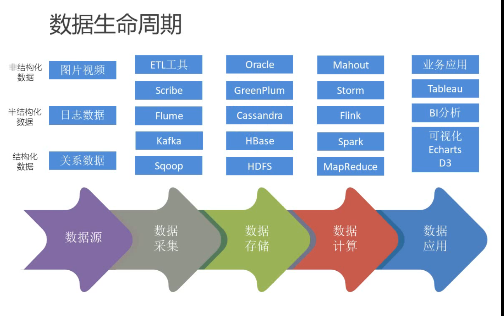

# 主要内容

- 项目框架
- 数据源解析
- 统计推荐模块
- 基于LFM的离线推荐模块
- 基于自定义模型的实时推荐模块
- 其他形式的离线相似推荐模块
  - 基于内容的推荐模块
  - 基于物品的协同过滤推荐模块

# 项目框架

- 大数据处理流程
- 系统模块设计
- 项目系统架构
- 项目数据流图

# 数据生命周期

- 项目中用到的主要的数据库是MongoDB

# 大数据处理流程

- 左边是实时处理流程
  - 用户接口
  - 后台服务器
  - 日志文件
  - 日志采集
  - 数据总线
  - 实时计算
  - 数据存储
  - 数据可视化
- 右边是离线处理流程
  - 用户接口
  - 后台服务器
  - 日志文件
  - 日志采集
  - 日志存储
  - 日志清洗
  - 数据加载
  - 数据仓库
  - 数据计算
  - 数据存储
  - 数据可视化

# 我们的目标

- 把各种推荐算法得到的结果做一个综合

- 点一个详情页后，得到的相似类别的推荐

