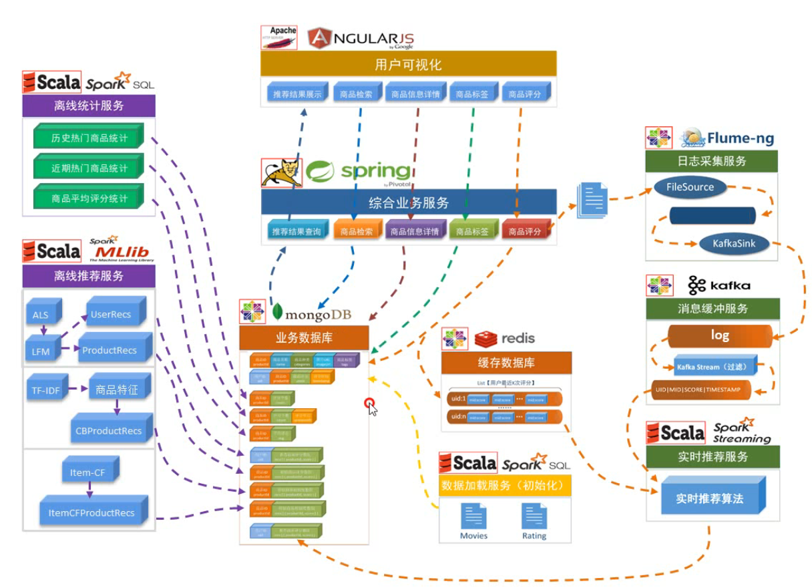
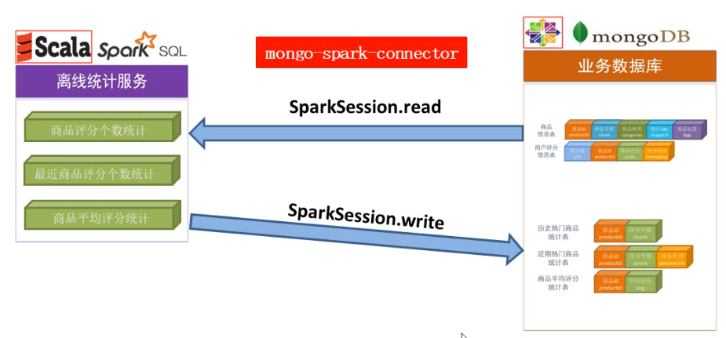
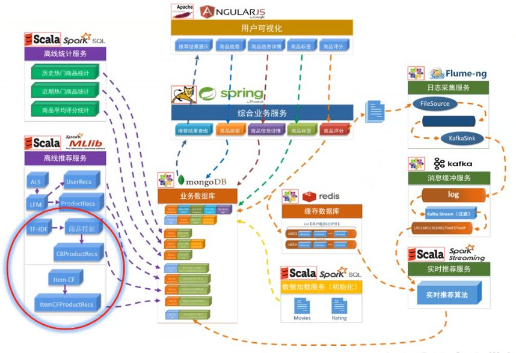

# 项目系统架构


- 左边为离线推荐计算，右边是实时推荐计算
- 中间主要实现数据的展示，存储，可操作界面
- 离线操作拿取数据主要是从业务数据库中拿取
- 实时操作中，从综合业务服务中拿取日志信息，实时计算方面是从业务数据库中拿取数据，也从Redis数据库中拿取数据，然后再将计算结果返回到业务数据库中、
- 业务数据库中的计算结果最终都会被展示

## 用户可视化界面

- 为用户提供接口，传递用户的操作和数据
- 使用的是Angularjs


## 综合业务服务

- 后台使用spring


## 数据存储


### 主业务数据库

- 使用MongoDB，数据库可以变
- MongoDB是文档型数据库，数据存储的结构类似于json
- MongoDB可能适用于半结构化的数据场景，例如一个商品的标签字段，每个商品的字段是不一样的

### 重要业务数据缓存

- Redis

## 离线推荐服务


## 实时推荐服务


- 实时推荐可能用到Redis里存储的数据

# 业务详细内容



## 用户可视化


### 展示给用户的内容

- 推荐结果展示
- 商品检索
- 商品信息详情
- 商品标签
- 商品评分

### 可视化流程

- 从MongoDB里拿取相关的数据，传给综合业务服务，也就是后台。最后将这些服务传给前台进行可视化

## 综合业务服务


### 针对前段可视化做的后台功能

- 推荐结果展示
- 商品检索
- 商品信息详情
- 商品标签
- 商品评分

## 数据库

会写一个数据加载服务，然后把数据放到MongoDB里


## 离线处理服务


### 实现的功能

离线统计服务

- 历史热门商品统计
- 近期热门商品统计
- 商品平均评分统计

### 离线推荐服务（个性化推荐）

- ALS算法实现推荐
- 基于TF-IDF提取商品特征，实现基于内容的推荐
- item-cf过滤相似物品，实现相似物品推荐

### 数据去向

- 最终计算的数据都会被存储到MongoDB里去

## 实时处理服务

- 用户做了某个操作之后，后台业务系统一方面会把该操作造成的数据改变做记录，记录到业务数据库里，另一方面将改变的数据放到Redis（缓存）里
- 另一方面这个修改数据会被放到log日志里，然后可以使用flume做实时的log收集
- 将日志数据传给kafka，进行缓冲处理
- 最后将过滤出来的数据传给spark streaming做实时计算
- spark streaming除了实时的日志数据，还会从Redis（缓冲数据库）里拿到最近的相关数据，还会从MongoDB（业务数据库）里拿到历时的相关数据

# 数据源解析

## 数据源分类

- 商品信息
- 用户评分数据

## 商品信息


- 商品ID：商品的唯一编号
- 商品名称：商品的名字
- 商品种类：是商品的特征信息
- 商品图片：用于商品展示的一个图片地址
- 商品标签：用户给商品定义的，用于商品推荐

## 用户评分信息


## 主要数据模型


- 右边前三张表，存储的是统计结果后的表
- 第四张表到第七张表存储的是离线推荐相关数据的表
- 相似度表可以被用来做实时推荐

# 统计推荐模块


- 历史热门商品统计
- 近期热门商品统计 
- 商品平均评分统计

### 逻辑

- 根据MongoDB中的商品的信息和用户信息，读取到spark session来做统计
- spark session做完统计之后，可以在写回到数据库中



## 历时热门商品统计

- 统计所有历史数据中每个商品的评分数

  - ```sql
    select productId, count(productId) as count from ratings group by productId order by count desc;
    ```

  - 存储到 RateMoreProducts表中

- RateMoreProducts数据结构：productId, count

## 近期热门商品统计

- 统计每个月的商品评分个数，就代表了商品近期的热门度

  - ```sql
    select productId, score, changeDate(timestamp) as yearmonth from ratings;
    ```

  - 存储到ratingOfMonth

  - ```sql
    select productId, count(productId) as count, yearmonth from ratingOfMonth group by yearmonth, productId order by yearmonth desc,count desc;
    ```

  - 存储到RateMoreRecentlyProducts

- changeDate:UDF函数，使用SimpleDateFormat对Date进行格式化，转化为格式为"yyyyMM"

- RateMoreRecentlyProducts数据结构，productId，count，yearmonth

## 商品平均评分统计

- 从评分表中读取评分数据并进行取平均值

  - ```sql
    select productId, avg(score) as avg from ratings group by productId order by avg desc;
    ```

  - 存储到AverageProducts

- AverageProducts数据结构，productId，avg

# 基于LFM的离线推荐模块


- 用ALS算法训练隐语义模型（LFM）
- 计算用户推荐矩阵
- 计算商品相似度矩阵

## ALS算法进行隐语义模型训练

- 训练流程
  - 
  - 首先将数据读取到DataSet，然后将数据转换为RDD模型
  - 然后让ALS读取RDD数据（弹性分布式数据集）即可

- 上面流程使用一句代码即可完成

  ```python
  val mode = ALS.train(trainData,rank,iterations,lambda);
  ```

  - rank：K值
  - iterations：迭代次数
  - lambda：政策化参数

### 模型评估和参数调整

- RMSE（平方根误差）：均方误差的算数平方根，预测值与真实值之间的误差
  - 
- 通过均方根误差，来多次调整参数值，选择RMSE最小的一组参数值

## 计算用户推荐矩阵


- 首先将用户的RDD数据与productRDD数据进行笛卡尔积，也就是两两结合
- 然后得到userproductRDD数据
- 通过之前训练的model数据来预测userproductRDD数据，得到预测评分
- 将得到的预测的评分通过Key来分组，得到每一组评分
- 然后将每组之间按照评分进行排序，得到推荐列表（格式：用户ID，一组推荐列表[商品ID，推荐评分，.... ]）
- 最后将数据写回到数据库

## 计算商品相似度矩阵

这里的相似结果是给后面的实时推荐做基础

### 相似度计算核心

- 距离相似度和余弦相似度
- 通过隐语义模型拿到用户和商品的特征向量

### 流程图


- 特征矩阵可以通过之前训练的model来获取
- 将两个产品的特征向量做笛卡尔积
- 将得到的笛卡尔积结果来计算余弦相似度公式来计算相似度
- 过滤掉相似度不满足的情况
- 最后得到的结果的数据结构：产品ID，[一组相似度（一个商品，一个相似度）]

# 实时推荐模块


- 计算速度要快
- 结果可以不是特别精确
- 有预先设计好的推荐模型

## 整体流程

1. 读取一条评分数据
2. 使用日志采集服务获取到数据
3. 然后将数据传输到kafka中进行处理
4. 最后将数据传给spark streaming来进行处理
5. spark streaming可能会拿取Redis中的一些最近的评分数据和在MongoDB中的物品的相似度数据
6. 最后将得到的推荐结果写回MongoDB中

## 推荐优先级计算

- 基本原理：用户最近一段时间的喜好是相似的
- 备选商品推荐优先级
  - 第一项：基础评分项
  - 后两个是偏移量
  - sim(q,r)表示商品q和商品r的相似度，Rr表示商品r的评分
  - incount：评分里的高分项个数
  - recount：评分里的低分项个数
  - Rr是用户评分
- 例子：计算备选商品x的推荐份数

### 推荐优先级计算流程


- 从最近的评分数据开始，得到相似商品，然后在Redis中拿到用户最近的K次评分
- 然后获取用户最近K次评分的商品和候选商品的相似度，然后计算出基础分数
- 在基础分数的基础上加上偏移项，得到推荐份数
- 结合前面的实时推荐结果并更新
- 得到新的推荐列表

# 其他形式的离线相似推荐



- 主要涉及到，在用户点击商品的详情页之后，下方会有推荐
- 基于商品的标签来推荐，也可以通过用户购买的商品和搜索的商品来推荐
- 主要涉及的表有：商品信息表和用户评分信息表

- **本次主要是根据用户高分评价过的商品以及相似标签的商品来推荐**（喜欢了这个书的人还看了哪些书）

## 基于内容的推荐

- 基于商品的用户UGC标签信息，用TF-IDF算法提取特征向量
- 计算特征向量的余弦相似度，从而得到商品的相似列表
- 在实际应用中，一般会在商品详情页、商品购买页将相似商品推荐出来

## 基于物品的协同过滤推荐

- 基于物品的协同过滤（item-CF），只需手机用户的常规行为数据（比如点击、收藏、购买）就可以得到商品间的相似度，在实际项目中应用很广
- “同现相似度”—利用行为数据计算不同商品间的相似度
  - 其中，Ni是购买商品i（或对商品i评分）的用户列表，Nj是购买商品j的用户列表 
  - 分子表示，同时购买了商品i和j的用户
  - 分母表示的是惩罚项。如果同时购买了商品i和j的人很少，那么分母就会很大。这就说明，两个商品同时出现的概率小，那么在这个商品i的界面中推荐商品j的概率就减少

## 混合推荐——分区混合

### 基于魔性的推荐+基于协同过滤的推荐+基于内容的推荐+基于统计的推荐


