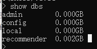
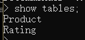
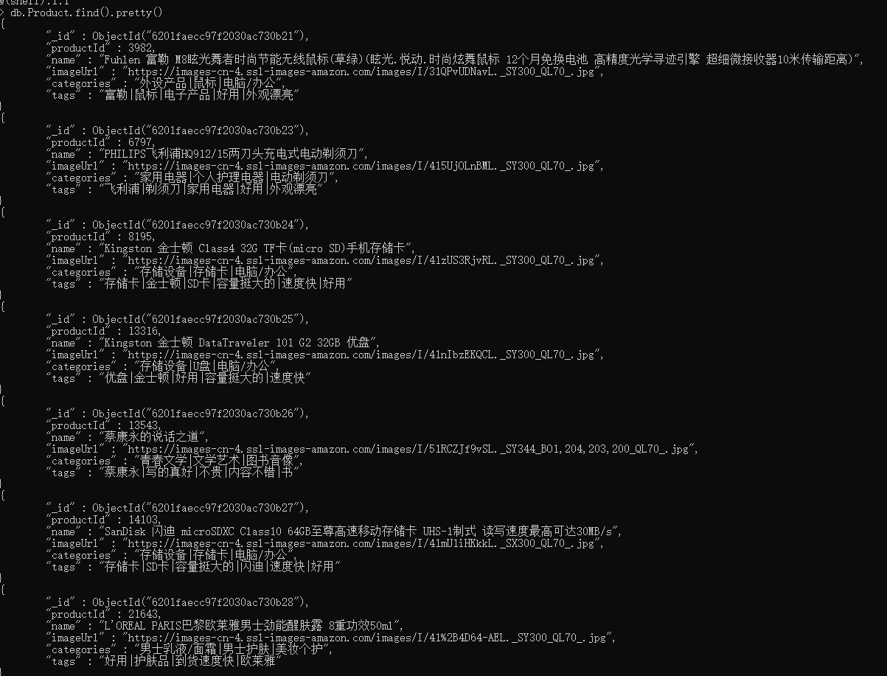
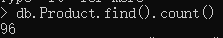
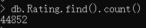

# 创建Scala class文件

- 在DataLoad项目的src/main/scala/目录下创建Scala Class文件
- 右击新建 Scala Class：DataLoader，选择object类型
- 第一次可能无法创建Scala Class文件，参考《Scala.md》

# 定义样例类

## product

- 根据product.csv文件中的一条数据定义样例类

  ```scala
  /**
   * product文件中第一行数据 ，分隔符采用的是^
   * @param productId		商品ID
   * @param name			商品名称
   * @param imageUrl		商品图片url
   * @param categories	商品分类
   * @param tags			商品标签
   */
  case class product(productId: Int, name: String, imageUrl: String, categories: String, tags: String);
  ```

## rating

- 根据rating.csv中的第一行数据来定义样例类

  ```scala
  /**
   * rating文件中的第一行数据， 分隔符采用的是 ,
   * @param userId		用户id
   * @param productId		产品id
   * @param score			产品评分
   * @param timestamp		时间戳
   */
  case class rating(userId: Int, productId: Int, score: Double, timestamp: Int);
  ```

## MongoConfig

- 封装MongoDB的连接配置

  ```scala
  /**
   * MongoDB连接配置
   * @param uri			连接地址
   * @param db			要操作的db
   */
  case class MongoConfig (uri: String, db: String);
  ```

  

# 定义整体框架

1. 创建spark配置项
2. 创建spark session
3. 加载产品数据和评分数据
4. 存储数据到MongoDB
5. 停止spark

```scala
object DataLoader {
  def main(args: Array[String]): Unit = {
    // 创建spark配置项
    val  sparkConf = null
    // 创建spark session
    val spark = null
    // 加载数据
    val productRDD = null
    val ratingRDD = null
    // 存储数据到Mongodb
    storeDataInMongoDb()
    // 停止
    spark.stop()
  }

  def storeDataInMongoDb(): Unit ={
    
  }
}
```


# 定义基本的配置参数

在Main函数中写入如下代码，基本的配置参数

```scala
    val config = Map(
      // 启用本地多线程
      "spark.cores" -> "local[*]",
      // 定义Mongo的uri
      "mongo.uri" -> "mongodb://localhost:27017/recommender",
      // 定义db
      "mongo.db" -> "recommender"
    )
```

# 完善代码

## 设置spark配置项，创建spark session

- 创建spark配置项

  ```scala
  val  sparkConf = new SparkConf().setMaster(config("spark.cores")).setAppName("DataLoader")
  ```

- 创建spark session

  ```scala
  val spark = SparkSession.builder().config(sparkConf).getOrCreate()
  ```

## 加载数据

在主函数里导入包，写的位置有规定，查看下方完整代码

```Scala
import spark.implicits._
```


1. 在类里设置文件路径

   ```scala
     val productPath = "D:\\file\\JavaFile\\ECommenderSystem\\Commender\\DataLoad\\src\\main\\resources\\products.csv"
     val ratingPath = "D:\\file\\JavaFile\\ECommenderSystem\\Commender\\DataLoad\\src\\main\\resources\\ratings.csv"
   ```

2. 细化加载数据代码

   ```scala
   // 加载数据product
   val productRDD = spark.sparkContext.textFile(productPath)
   val productDF = productRDD.map(item => {
   // product数据通过^分割，切分出来
   val attr = item.split("\\^")
   // 转换成Product
   product(attr(0).toInt, attr(1).trim, attr(4).trim, attr(5).trim, attr(6).trim)
       }).toDF()
   
   // 加载数据rating 
   val ratingRDD = spark.sparkContext.textFile(ratingPath)
   val ratingDF = productRDD.map(item => {
   // rating数据通过,分割，切分出来
   val attr = item.split(",")
   // 转换成rating
   rating(attr(0).toInt, attr(1).toInt,attr(2).toDouble,attr(3).toInt)
       }).toDF()
   ```

# 数据存储MongDB

1. 创建隐式参数，以不至于每次存储数据都创建参数

   ```Scala
   implicit val mongoConfig = MongoConfig(config("mongo.uri"),config("mongo.db"))
   ```

2. 定义函数：storeDataInMongoDb(productDF,ratingDF)，传入两个参数，就是之前读取的数据文件

   ```scala
     def storeDataInMongoDb(productDF: DataFrame, ratingDF: DataFrame)(implicit mongoConfig: MongoConfig): Unit ={
       // 新建mongoDB连接
       val mongoClient = MongoClient( MongoClientURI(mongoConfig.uri))
       // 定义要操作的MongoDB的表,可以理解为：db.Product
       val productCollection = mongoClient(mongoConfig.db)(MONGODB_PRODUCT_COLLECTION)
       val ratingCollection = mongoClient(mongoConfig.db)(MONGODB_RATING_COLLECTION)
   
       // 如果表已经存在，则删掉
       productCollection.dropCollection()
       ratingCollection.dropCollection()
   
       // 将当前数据存入对应的表中
       productDF.write
         .option("uri", mongoConfig.uri)
         .option("collection", MONGODB_PRODUCT_COLLECTION)
         .mode("overwrite")
         .format("com.mongodb.spark.sql")
         .save()
   
       ratingDF.write
         .option("uri", mongoConfig.uri)
         .option("collection", MONGODB_RATING_COLLECTION)
         .mode("overwrite")
         .format("com.mongodb.spark.sql")
         .save()
   
       // 对表创建索引
       productCollection.createIndex( MongoDBObject("productId" -> 1) )
       ratingCollection.createIndex( MongoDBObject("productId" -> 1) )
       ratingCollection.createIndex( MongoDBObject("userId" -> 1) )
   
       mongoClient.close()
     }
   ```

   

# 完整代码

```Scala
//import com.mongodb.MongoClientURI
import com.mongodb.casbah.Imports.MongoClientURI
import com.mongodb.casbah.MongoClient
import com.mongodb.casbah.commons.MongoDBObject
import org.apache.spark.SparkConf
import org.apache.spark.sql.{DataFrame, SparkSession}
/**
 * product文件中第一行数据 ，分隔符采用的是  ^
 * @param productId
 * @param name
 * @param imageUrl
 * @param categories
 * @param tags
 */
case class product(productId: Int, name: String, imageUrl: String, categories: String, tags: String);

/**
 * rating文件中的第一行数据， 分隔符采用的是 ,
 * @param userId
 * @param productId
 * @param score
 * @param timestamp
 */
case class rating(userId: Int, productId: Int, score: Double, timestamp: Int);

/**
 * MongoDB连接配置
 * @param uri
 * @param db
 */
case class MongoConfig(uri: String, db: String);

object DataLoader {
  // 定义文件路径
  val productPath = "D:\\file\\JavaFile\\ECommenderSystem\\Commender\\DataLoad\\src\\main\\resources\\products.csv"
  val ratingPath = "D:\\file\\JavaFile\\ECommenderSystem\\Commender\\DataLoad\\src\\main\\resources\\ratings.csv"
  // 定义MongoDB中存储的表名
  val MONGODB_PRODUCT_COLLECTION = "Product"
  val MONGODB_RATING_COLLECTION = "Rating"
  def main(args: Array[String]): Unit = {

    val config = Map(
      // 启用本地多线程
      "spark.cores" -> "local[*]",
      // 定义Mongo的uri
      "mongo.uri" -> "mongodb://localhost:27017/recommender",
      // 定义db
      "mongo.db" -> "recommender"
    )

    // 创建spark配置项
    val  sparkConf = new SparkConf().setMaster(config("spark.cores")).setAppName("DataLoader")
    // 创建spark session
    val spark = SparkSession.builder().config(sparkConf).getOrCreate()

    import spark.implicits._
    // 加载数据
    val productRDD = spark.sparkContext.textFile(productPath)
    val productDF = productRDD.map(item => {
      // product数据通过^分割，切分出来
      val attr = item.split("\\^")
      // 转换成Product
//      println("============================product_start====================================")
//      print(attr(0).toInt)
//      print(attr(1).trim)
//      print(attr(4).trim)
//      print(attr(5).trim)
//      print(attr(6).trim)
//      println("=========================product_end=======================================")
      product(attr(0).toInt, attr(1).trim, attr(4).trim, attr(5).trim, attr(6).trim)
    }).toDF()

    val ratingRDD = spark.sparkContext.textFile(ratingPath)
    val ratingDF = ratingRDD.map(item => {
      // rating数据通过,分割，切分出来
      val attr = item.split(",")
      // 转换成rating
//      println("=============================rating_start===================================")
//      print(attr(0).toInt)
//      print(attr(1).toInt)
//      print(attr(2).toDouble)
//      print(attr(3).toInt)
//      println("==========================rating_end======================================")
      rating(attr(0).toInt, attr(1).toInt,attr(2).toDouble,attr(3).toInt)
    }).toDF()

    // 存储数据到Mongodb
    // 创建隐式参数
    implicit val mongoConfig = MongoConfig(config("mongo.uri"),config("mongo.db"))
    storeDataInMongoDb(productDF,ratingDF)
    // 停止
    spark.stop()
  }

  def storeDataInMongoDb(productDF: DataFrame, ratingDF: DataFrame)(implicit mongoConfig: MongoConfig): Unit ={
    // 新建mongoDB连接
    val mongoClient = MongoClient( MongoClientURI(mongoConfig.uri))
    // 定义要操作的MongoDB的表,可以理解为：db.Product
    val productCollection = mongoClient(mongoConfig.db)(MONGODB_PRODUCT_COLLECTION)
    val ratingCollection = mongoClient(mongoConfig.db)(MONGODB_RATING_COLLECTION)

    // 如果表已经存在，则删掉
    productCollection.dropCollection()
    ratingCollection.dropCollection()

    // 将当前数据存入对应的表中
    productDF.write
      .option("uri", mongoConfig.uri)
      .option("collection", MONGODB_PRODUCT_COLLECTION)
      .mode("overwrite")
      .format("com.mongodb.spark.sql")
      .save()

    ratingDF.write
      .option("uri", mongoConfig.uri)
      .option("collection", MONGODB_RATING_COLLECTION)
      .mode("overwrite")
      .format("com.mongodb.spark.sql")
      .save()

    // 对表创建索引
    productCollection.createIndex( MongoDBObject("productId" -> 1) )
    ratingCollection.createIndex( MongoDBObject("productId" -> 1) )
    ratingCollection.createIndex( MongoDBObject("userId" -> 1) )

    mongoClient.close()
  }
}
```

# 查看结果

- 在打开两个cmd，第一个输入mongod启动MongoDB service。第二个输入mongo启动客户端

- 通过

  ```sql
  show dbs
  ```

  查看数据库

  

  - 多出了一个recommender数据库，并且大小为0.002GB

- 使用

  ```sql
  show tables
  ```

  查看该数据库的表

  

- 使用

  ```MongoDB
  db.Product.find().pretty()
  ```

  查看数据

  - 每条数据中，id是自动生成的，其他的都是指定的数据

- 通过

  ```MongoDB
  db.Product.find().count()
  ```

  确定数据量是否对

  

  

# 出现的问题

## scalac: Error: class Statics does not have a member ioobe

- 说明Scala和spark版本不对，
- 这里spark的版本是2.11，所以Scala的jdk版本需要设置为2.11版本
- [(29条消息) (spark问题一)scala开发spark遇到的奇怪bug_yx_keith的博客-CSDN博客](https://blog.csdn.net/yx_keith/article/details/81159497)

## encountered unrecoverable cycle resolving import.

- 语句：import spark.implicits._的位置不对，调整一下即可
- [(29条消息) idea spark出现encountered unrecoverable cycle resolving_m1913843179的博客-CSDN博客](https://blog.csdn.net/m1913843179/article/details/107187119)

## reference to MongoClientURI is ambiguous; it is imported twice in the same s

- 导入包出现了两次，去掉一次，就是第一个包，我把它注释了

