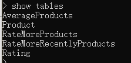
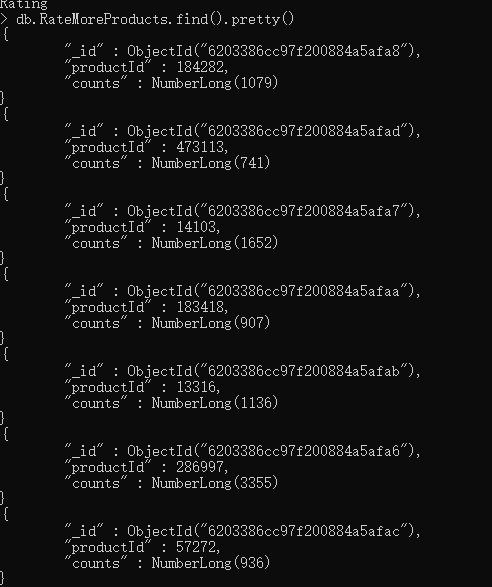
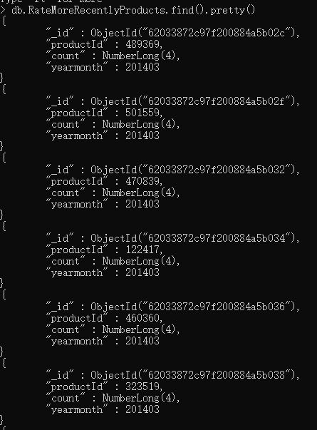
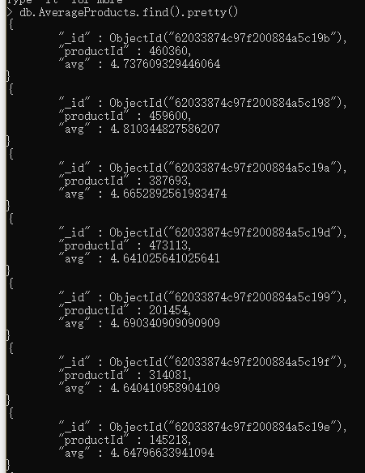

# 准备StatisticsRecommender（统计推荐模块）模块

## 新建模块

- 在Commender下新建模块**StatisticsRecommender**。

## 导入依赖

- 该模块需要的依赖和DataLoader需要的依赖一模一样

- 直接复制粘贴

  ```pom
  <dependencies>
          <!-- Spark的依赖引入 -->
          <dependency>
              <groupId>org.apache.spark</groupId>
              <artifactId>spark-core_2.11</artifactId>
          </dependency>
          <dependency>
              <groupId>org.apache.spark</groupId>
              <artifactId>spark-sql_2.11</artifactId>
          </dependency>
          <!-- 引入Scala -->
          <dependency>
              <groupId>org.scala-lang</groupId>
              <artifactId>scala-library</artifactId>
          </dependency>
          <!-- 加入MongoDB的驱动 -->
          <dependency>
              <groupId>org.mongodb</groupId>
              <artifactId>casbah-core_2.11</artifactId>
              <version>${casbah.version}</version>
          </dependency>
          <dependency>
              <groupId>org.mongodb.spark</groupId>
              <artifactId>mongo-spark-connector_2.11</artifactId>
              <version>${mongodb-spark.version}</version>
          </dependency>
      </dependencies>
  
  ```

## 加入日志配置

- 在该项目的resources目录下加入log4j的配置文件
- 直接从DataLoader复制即可

## 将Main目录下的Java文件夹改名为scala

## 新建scala class文件

- 新建scala class文件，选择Object类型，并且命名文StatisticsRecommender

# 代码编写

## 代码框架

1. 构建样例类
2. 构建配置项
3. 加载数据
4. 处理数据
5. 存储数据
6. 结束

## 构建样例类

- 因为统计推荐模块跟商品的评分相关，跟商品的信息无关，因此需要建立商品的评分样例类，这部分直接从DataLoader中复制
- 需要向MongoDB中读写数据，因此还需要MongoDB配置项样例类，直接从DataLoader中赋值即可

```scala
/**
 * 评分表样例类
 * @param userId
 * @param productId
 * @param score
 * @param timestamp
 */
case class Rating(userId: Int, productId: Int, score: Double, timestamp: Int);

/**
 * 连接配置项样例类
 * @param uri
 * @param db
 */
case class MongoConfig(uri: String, db: String);
```

## 需要用到的表

- 首先需要用到评分表
- 然后根据统计的数据，需要建立三张表，分别存放：高评分产品、高评分且最近的产品以及商品平均评分

```scala
  // 商品评分表
  val MONGODB_RATING_COLLECTION = "Rating"
  // 存放统计数据的表
  val RATE_MORE_PRODUCTS = "RateMoreProducts"
  val RATE_MORE_RECENTLY_PRODUCTS = "RateMoreRecentlyProducts"
  val AVERAGE_PRODUCTS = "AverageProducts"
```


## Main函数编写

### 写入配置项，方便写入配置

```scala
    val config = Map(
      // 启用本地多线程
      "spark.cores" -> "local[*]",
      // 定义Mongo的uri
      "mongo.uri" -> "mongodb://localhost:27017/recommender",
      // 定义db
      "mongo.db" -> "recommender"
    )
```


### 创建Spark Config，建立Spark Session

```scala
    // 创建spark配置项
    val  sparkConf = new SparkConf().setMaster(config("spark.cores")).setAppName("StatisticsRecommender")
    // 创建spark session
    val spark = SparkSession.builder().config(sparkConf).getOrCreate()

    import spark.implicits._
```

### 隐式传参MongoConfig

```scala
    // 创建隐式参数
    implicit val mongoConfig = MongoConfig(config("mongo.uri"),config("mongo.db"))
```

### 加载数据

- 主要设计的就是读取数据，将读出的数据转换为DataFrame格式

```scala
    // 加载数据
    val ratingDF = spark.read
      .option("uri", mongoConfig.uri)
      .option("collection", MONGODB_RATING_COLLECTION)
      .format("com.mongodb.spark.sql")
      .load()
      .as[Rating]
      .toDF()
```

### 商品数据统计

- 首先需要创建一张临时表，方便存储评分数据

  ```scala
      // 创建一张临时表
      ratingDF.createTempView("ratings")
  ```

- 然后根据系统概要设计中的离线推荐模块设计，将该模块分为三个功能

  - 历时热门商品：按照评分个数进行统计

    ```scala
        // 需要获取的列：productId和商品数量
        val rateMoreProductDF = spark.sql("select productId, count(productId) from Rating group by productId order count desc")
        // 写入数据到MongoDB
        storeDFINMongoDB(rateMoreProductDF, RATE_MORE_PRODUCTS)
    ```

  - 近期热门商品：需要涉及到时间戳，把时间戳转换成yyyyMM格式进行评分个数统计

    1. 首先创建UDF函数
    2. 然后查询需要的数据（主要是时间戳转换成年月格式）生成新的表
    3. 在新的表中查询需要的数据

    ```scala
        // 创建日期格式化工具
        val simpleDateFormat = new SimpleDateFormat("yyyyMM")
        // 注册UDF(用户自定义函数)，将timestamp转换为年月格式
        spark.udf.register("changeDate", (x:Int) => simpleDateFormat.format(new Date(x * 1000L)).toInt)
        // 从MongoDB中查询rating表，得到  productID，score以及yearmonth三条数据
        val ratingOfYearMonthDF = spark.sql("select productId, score, changeDate(timestamp) as yearmonth from Rating")
        // 转换为临时表
        ratingOfYearMonthDF.createOrReplaceTempView("ratingOfMonth")
        // 然后从表ratingOfYearMonthDF中进行统计查询，得到：productId，商品数量以及年月
        val rateMoreRecentlyProductsDF = spark.sql("select productId, count(productId) as count, yearmonth from ratingOfMonth group by yearmonth,prodictId order by yearmongth desc,count desc")
        // 将得到的查询数据写入到MongoDB
        storeDFINMongoDB(rateMoreRecentlyProductsDF, RATE_MORE_RECENTLY_PRODUCTS)
    ```

    

  - 商品平均评分统计：商品的平均评分

    ```scala
        // 从Rating表中查询数据，得到：productId，平均评分
        val averageProducts = spark.sql("select productId, avg(score) as avg from Rating group by productId order by avg desc")
        storeDFINMongoDB(averageProducts, AVERAGE_PRODUCTS)
    ```

    

- 该部分功能能按照系统设计时的设计，只要通过sql语句来做，具体查看项目系统设计

# 最终代码

```scala
import org.apache.spark.SparkConf
import org.apache.spark.sql.{DataFrame, SparkSession}

import java.text.SimpleDateFormat
import java.util.Date

/**
 * 评分表样例类
 * @param userId
 * @param productId
 * @param score
 * @param timestamp
 */
case class Rating(userId: Int, productId: Int, score: Double, timestamp: Int);

/**
 * 连接配置项样例类
 * @param uri
 * @param db
 */
case class MongoConfig(uri: String, db: String);

object StatisticsRecommender {
  // 商品评分表
  val MONGODB_RATING_COLLECTION = "Rating"
  // 存放统计数据的表
  val RATE_MORE_PRODUCTS = "RateMoreProducts"
  val RATE_MORE_RECENTLY_PRODUCTS = "RateMoreRecentlyProducts"
  val AVERAGE_PRODUCTS = "AverageProducts"

  def main(args: Array[String]): Unit = {
    val config = Map(
      // 启用本地多线程
      "spark.cores" -> "local[*]",
      // 定义Mongo的uri
      "mongo.uri" -> "mongodb://localhost:27017/recommender",
      // 定义db
      "mongo.db" -> "recommender"
    )

    // 创建spark配置项
    val  sparkConf = new SparkConf().setMaster(config("spark.cores")).setAppName("DataLoader")
    // 创建spark session
    val spark = SparkSession.builder().config(sparkConf).getOrCreate()

    import spark.implicits._

    // 创建隐式参数
    implicit val mongoConfig = MongoConfig(config("mongo.uri"),config("mongo.db"))

    // 加载数据
    val ratingDF = spark.read
      .option("uri", mongoConfig.uri)
      .option("collection", MONGODB_RATING_COLLECTION)
      .format("com.mongodb.spark.sql")
      .load()
      .as[Rating]
      .toDF()

    // 将读到的数据转换成临时表
    ratingDF.createTempView("ratings")

    // TODO: 历史商品热门统计
    // 需要获取的列：productId和商品数量
    val rateMoreProductDF = spark.sql("select productId, count(productId) as counts from ratings group by productId order by counts desc")
    // 写入数据到MongoDB
    storeDFINMongoDB(rateMoreProductDF, RATE_MORE_PRODUCTS)

    // TODO: 近期热门商品
    // 创建日期格式化工具
    val simpleDateFormat = new SimpleDateFormat("yyyyMM")
    // 注册UDF(用户自定义函数)，将timestamp转换为年月格式
    spark.udf.register("changeDate", (x:Int) => simpleDateFormat.format(new Date(x * 1000L)).toInt)
    // 从MongoDB中查询rating表，得到  productID，score以及yearmonth三条数据
    val ratingOfYearMonthDF = spark.sql("select productId, score, changeDate(timestamp) as yearmonth from ratings")
    // 转换为临时表
    ratingOfYearMonthDF.createOrReplaceTempView("ratingOfMonth")
    // 然后从表ratingOfYearMonthDF中进行统计查询，得到：productId，商品数量以及年月
    val rateMoreRecentlyProductsDF = spark.sql("select productId, count(productId) as count, yearmonth from ratingOfMonth group by yearmonth,productId order by yearmonth desc,count desc")
    // 将得到的查询数据写入到MongoDB
    storeDFINMongoDB(rateMoreRecentlyProductsDF, RATE_MORE_RECENTLY_PRODUCTS)

    // TODO: 商品平均评分
    // 从Rating表中查询数据，得到：productId，平均评分
    val averageProducts = spark.sql("select productId, avg(score) as avg from ratings group by productId order by avg desc")
    storeDFINMongoDB(averageProducts, AVERAGE_PRODUCTS)

    spark.stop()
  }

  /**
   * 存储数据到数据库
   * @param df
   * @param collection_name
   * @param mongoConfig
   */

  def storeDFINMongoDB(df: DataFrame, collection_name: String)(implicit mongoConfig: MongoConfig): Unit = {
    df.write.option("uri",mongoConfig.uri)
      .option("collection",collection_name)
      .mode("overwrite")
      .format("com.mongodb.spark.sql")
      .save()
  }

}
```


# 结果检测

- 进入CMD界面启动MongoDB

- 查看recommender数据库下的表

  - 
  - 可以看出多出了三个表

- 查询RateMoreProducts表

  ```shell
  db.RateMoreProducts.find().pretty()
  ```

  

- 查询RateMoreRecentlyProducts表

  ```shell
  db.RateMoreRecentlyProducts.find().pretty()
  ```

  

- 查询AverageProducts表

  ```shell
  db.AverageProducts.find().pretty()
  ```

  

