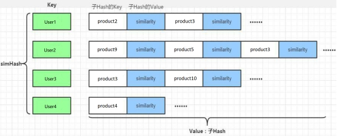
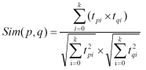
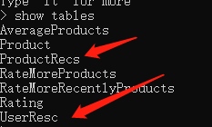
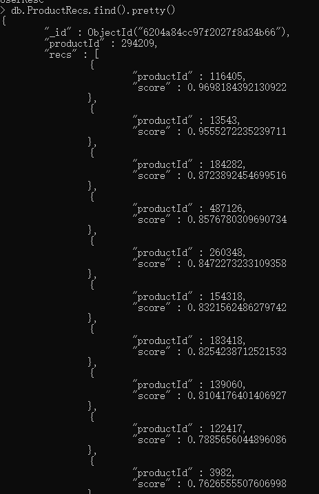
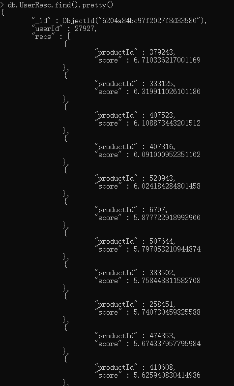

# 隐语义模型（LMF）

- 项目采用ALS作为协同过滤算法，根据MongoDB中的用户评分表计算离线的用户商品推荐列表以及商品相似矩阵。

# 商品推荐列表产生思路

通过ALS训练出来的Model来计算所有当前用户商品的推荐列表，主要思路如下：

1. userId和productId做笛卡尔积，产生(userId,productId)的元组
2. 通过模型预测(userId,productId)对应的评分
3. 将预测结果通过预测分值进行排序
4. 返回分数值最大的K个商品，作为当前用户的推荐列表

最后生成的数据结构如下：将数据保存到MongoDB的UserRecs表中

## 商品推荐列表格式



# 商品相似度矩阵

为之后商品实时推荐做基础

# 建立模块

- 在Commender下新建模块，并命名为OfflineRecommender

- 在该项目下添加如下依赖

  ```pom
  <dependencies>
  
      <dependency>
          <groupId>org.scalanlp</groupId>
          <artifactId>jblas</artifactId>
          <version>${jblas.version}</version>
      </dependency>
  
      <!-- Spark的依赖引入 -->
      <dependency>
          <groupId>org.apache.spark</groupId>
          <artifactId>spark-core_2.11</artifactId>
      </dependency>
      <dependency>
          <groupId>org.apache.spark</groupId>
          <artifactId>spark-sql_2.11</artifactId>
      </dependency>
      <dependency>
          <groupId>org.apache.spark</groupId>
          <artifactId>spark-mllib_2.11</artifactId>
      </dependency>
      <!-- 引入Scala -->
      <dependency>
          <groupId>org.scala-lang</groupId>
          <artifactId>scala-library</artifactId>
      </dependency>
  
      <!-- 加入MongoDB的驱动 -->
      <!-- 用于代码方式连接MongoDB -->
      <dependency>
          <groupId>org.mongodb</groupId>
          <artifactId>casbah-core_2.11</artifactId>
          <version>${casbah.version}</version>
      </dependency>
      <!-- 用于Spark和MongoDB的对接 -->
      <dependency>
          <groupId>org.mongodb.spark</groupId>
          <artifactId>mongo-spark-connector_2.11</artifactId>
          <version>${mongodb-spark.version}</version>
      </dependency>
  </dependencies>
  ```

- 添加日志配置文件log4j

- 将main文件夹下的Java文件夹改名为scala，并在该文件夹下创建Scala class 文件，命名为OfflineRecommender

# 整体框架

1. 定义样例类
2. 定义必要的常量数据
3. 在main函数里编写代码

# 定义样例类

- 因为涉及到对商品评分的操作，因此需要评分样例类
- 因为涉及到从MongoDB读取数据，所以还需要MongoDB连接配置样例类
- 因为要对用户进行商品推荐，因此还需要一个推荐列表样例类
- 当然还有副产品，商品相似度列表。相似度列表主要针对一个商品有一个一系列的相似度商品列表，其格式和商品推荐列表相似

```scala
  /**
   * 评分样例类
   * @param userId
   * @param productId
   * @param score
   * @param timestamp
   */
  case class ProductRating(userId: Int, productId: Int, score: Double, timestamp: Int);

  /**
   * MongoDB连接配置样例类
   * @param uri
   * @param db
   */
  case class MongoConfig(uri: String, db: String);

  /**
   * 标准推荐样例类
   * @param productId
   * @param score
   */
  case class Recommendation(productId: Int, score: Double);

  /**
   * 用户推荐样例类
   * @param userId
   * @param recs
   */
  case class UserRecs(userId: Int, recs: Seq[Recommendation]);

  /**
   * 商品相似度列表
   * @param productId
   * @param recs
   */
  case class ProductRecs(productId: Int, recs: Seq[Recommendation]);
```

# 定义表名以及常量

- 需要从MongoDB中读取Rating数据，需要定义表名Rating
- 需要生成的列表有两个
  - 用户推荐列表
  - 商品相似度列表
- 需要定义推荐的个数，为20个

```Scala
  // 定义表名
  val MONGODB_RATING_COLLECTION = "Rating"
  val USER_RESC = "UserResc"
  val PRODUCT_RESC = "ProductResc"
  // Max-length of recommendation collection
  val USER_MAX_RECOMMENDATION = 20 
```

# Main函数编写

## 思路

1. 准备配置项和必要的包
2. 核心计算
3. 写回数据库

## 定义配置项，引入隐式(implicits)包

- 创建配置Map对象，方便调用，规整
- 创建spark配置项
- 创建spark session
- 导入隐式包
- 创建隐式参数

```scala
val config = Map(
      // 启用本地多线程
      "spark.cores" -> "local[*]",
      // 定义Mongo的uri
      "mongo.uri" -> "mongodb://localhost:27017/recommender",
      // 定义db
      "mongo.db" -> "recommender"
    )

    // 创建spark配置项
    val  sparkConf = new SparkConf().setMaster(config("spark.cores")).setAppName("OfflineRecommender")
    // 创建spark session
    val spark = SparkSession.builder().config(sparkConf).getOrCreate()

    import spark.implicits._

    // 创建隐式参数
    implicit val mongoConfig = MongoConfig(config("mongo.uri"),config("mongo.db"))
```


## 准备数据

- 加载的数据希望是RDD数据类型
- 读取数据直接采用的spark的read方法

```scala
     // 读取数据
    val ratingRDD = spark.read
      .option("uri", mongoConfig.uri)
      .option("collection", MONGODB_RATING_COLLECTION)
      .format("com.mongodb.spark.sql")
      .load()
      .as[ProductRating]
      .rdd
      .map(
        rating => (rating.userId, rating.productId, rating.score)
      )
      // .cache()的作用是将数据持久化在内存中
      .cache()
```

- 然后需要获取user和product的RDD数据

```scala
    // 提取出所有用户和商品的数据集
    // userRDD从ratingRDD中取出第一列数据，但是可能会有重复的数据，因此调用distinct函数
    val userRDD = ratingRDD.map(_._1).distinct()
    // productRDD同理
    val productRDD = ratingRDD.map(_._2).distinct()
```


## 核心计算

1. 训练隐语义模型
2. 得到预测评分矩阵，得到用户的推荐列表
3. 利用商品的特征向量，计算商品的相似度列表

## 训练隐语义模型

```scala
    // 准备数据,需要将trainData写成专门的Rating数据这个数据来自于包：import org.apache.spark.mllib.recommendation.{ALS, Rating}
    val trainData = ratingRDD.map(x => Rating(x._1,x._2,x._3))
    // 设定参数:rank隐特征数量，iteration迭代次数，lambda正则胡系数,参数可以调整的
    val (rank,iteration,lambda) = (5,10,0.01)
    // 训练模型
    val model = ALS.train(trainData,rank,iteration,lambda)
```


## 获取用户推荐列表

```Scala
    // 用userRDD和productRDD做笛卡尔积，来创建参数
    val userProducts = userRDD.cartesian(productRDD)
    // 使用模型进行预测，得到预测评分矩阵。predict函数得到的是RDD[Rating]数据
    val preRating = model.predict(userProducts)
    // 从预测评分矩阵中得到用户推荐列表
    // filter函数里rating表示的是RDD[rating]的一个实例
    val userRecs = preRating.filter(_.rating>0)
      // 将数据格式进行转换为 (A,(B,C))，A是Key，之后可以通过groupbykey的函数将相同的key的数据进行整合
      .map(
        // 因为rating是Rating类型的，所以，rating理所应当包含 user， product 和 rating
        rating => (rating.user, (rating.product, rating.rating))
      )
      .groupByKey()
      .map{
        // 这里操作主要目的是排序取前x条数据
        // 将数据转换成UserRecs格式
        case (userId,recs) =>
          UserRecs(userId, recs.toList.sortWith(_._2>_._2).take(USER_MAX_RECOMMENDATION)
            // 将数据转换成Recommendation样例类格式
            .map(x=>Recommendation(x._1,x._2)))
      }
      // 为了写入到数据库，需要转换成DF类型
      .toDF()

    // 写入到数据库
    userRecs.write
      .option("uri",mongoConfig.uri)
      .option("collection",USER_RESC)
      .mode("overwrite")
      .format("com.mongodb.spark.sql")
      .save()
```

## 获取商品相似度列表 

```scala
    // 获取商品特征向量，返回的是一个RDD数据类型，是一个二元数组，第一个是productId，第二个是一个数组，是特征值组成的数组
    val productFeatures = model.productFeatures.map{
      case (productId, features) => (productId, new DoubleMatrix(features))
    }
    // 两两配对商品（自己与自己做笛卡尔积）
    val productRecs =productFeatures.cartesian(productFeatures)
      // 过滤掉自己和自己配对的数据
      .filter{
        case (a,b) => a._1  != b._1
      }
    // 将数据改为如下格式:(商品id, (被比较的商品Id, 相似度))
      .map{
        case (a, b) =>
          // 在这里计算了余弦相似度
          val simScore = consinSim(a._2,b._2)
          // 这里是最终修改的数据格式
          (a._1, (b._1, simScore))
      }
      // 根据第二项中的第二项，过滤掉分数较小的数据
      .filter(_._2._2 > 0.4)
      // 和前边一样，对数据按照productId进行分组
      .groupByKey()
      // 将数据转换成我们想要的格式，也就是ProductRecs样例类的类型
      .map{
        case (productId,recs) =>
          ProductRecs(productId, recs.toList.sortWith(_._2>_._2)
            // 将数据转换成Recommendation样例类格式
            .map(x=>Recommendation(x._1,x._2)))
      }
      // 转换成可以写入数据库的类型
      .toDF()
    // 写入数据库
    productRecs.write
      .option("uri",mongoConfig.uri)
      .option("collection",PRODUCT_RESC)
      .mode("overwrite")
      .format("com.mongodb.spark.sql")
      .save()
```

### 定义余弦相似度函数



- 余弦相似度函数的输入是两个函数
- 分子是两个向量做点积
- 分母是两个向量的模相乘

```scala
  def consinSim(product1: DoubleMatrix, product2: DoubleMatrix): Double={
    product1.dot(product2)/(product1.norm2()*product2.norm2())
  }
```


# 整体代码

```scala
import org.apache.spark.SparkConf
import org.apache.spark.mllib.recommendation.{ALS, Rating}
import org.apache.spark.sql.SparkSession
import org.jblas.DoubleMatrix

object OfflineRecommender {

  /**
   * 评分样例类
   * @param userId
   * @param productId
   * @param score
   * @param timestamp
   */
  case class ProductRating(userId: Int, productId: Int, score: Double, timestamp: Int);

  /**
   * MongoDB连接配置样例类
   * @param uri
   * @param db
   */
  case class MongoConfig(uri: String, db: String);

  /**
   * 标准推荐样例类
   * @param productId
   * @param score
   */
  case class Recommendation(productId: Int, score: Double);

  /**
   * 用户推荐样例类
   * @param userId
   * @param recs
   */
  case class UserRecs(userId: Int, recs: Seq[Recommendation]);

  /**
   * 商品相似度列表
   * @param productId
   * @param recs
   */
  case class ProductRecs(productId: Int, recs: Seq[Recommendation]);

  // 定义表名
  val MONGODB_RATING_COLLECTION = "Rating"
  val USER_RESC = "UserResc"
  val PRODUCT_RESC = "ProductRecs"
  // Max-length of recommendation collection
  val USER_MAX_RECOMMENDATION = 20

  def main(args: Array[String]): Unit = {
    val config = Map(
      // 启用本地多线程
      "spark.cores" -> "local[*]",
      // 定义Mongo的uri
      "mongo.uri" -> "mongodb://localhost:27017/recommender",
      // 定义db
      "mongo.db" -> "recommender"
    )

    // 创建spark配置项
    val  sparkConf = new SparkConf().setMaster(config("spark.cores")).setAppName("OfflineRecommender")
    // 创建spark session
    val spark = SparkSession.builder().config(sparkConf).getOrCreate()

    import spark.implicits._

    // 创建隐式参数
    implicit val mongoConfig = MongoConfig(config("mongo.uri"),config("mongo.db"))

    // 准备数据
    val ratingRDD = spark.read
      .option("uri", mongoConfig.uri)
      .option("collection", MONGODB_RATING_COLLECTION)
      .format("com.mongodb.spark.sql")
      .load()
      .as[ProductRating]
      .rdd
      .map(
        rating => (rating.userId, rating.productId, rating.score)
      )
      // .cache()的作用是将数据持久化在内存中
      .cache()

    // 提取出所有用户和商品的数据集
    // userRDD从ratingRDD中取出第一列数据，但是可能会有重复的数据，因此调用distinct函数
    val userRDD = ratingRDD.map(_._1).distinct()
    // productRDD同理
    val productRDD = ratingRDD.map(_._2).distinct()

    /** TODO: 核心计算过程
     *  1、训练隐语义模型
     *  2、得到预测评分矩阵，得到用户的推荐列表
     *  3、利用商品特征向量，计算商品的相似度矩阵
    */
    /**
     * 训练隐语义模型
     */
    // 准备数据,需要将trainData写成专门的Rating数据这个数据来自于包：import org.apache.spark.mllib.recommendation.{ALS, Rating}
    // 这个Rating样例类的包含的参数有 ： user product 还有 rating ，分别是Int Int Double
    val trainData = ratingRDD.map(x => Rating(x._1,x._2,x._3))
    // 设定参数:rank隐特征数量，iteration迭代次数，lambda正则胡系数,参数可以调整的
    val (rank,iteration,lambda) = (5,10,0.01)
    // 训练模型
    val model = ALS.train(trainData,rank,iteration,lambda)

    /**
     * 获得预测评分矩阵
     */
    // 用userRDD和productRDD做笛卡尔积，来创建参数
    val userProducts = userRDD.cartesian(productRDD)
    // 使用模型进行预测，得到预测评分矩阵。predict函数得到的是RDD[Rating]数据
    val preRating = model.predict(userProducts)
    // 从预测评分矩阵中得到用户推荐列表
    // filter函数里rating表示的是RDD[rating]的一个实例
    val userRecs = preRating.filter(_.rating>0)
      // 将数据格式进行转换为 (A,(B,C))，A是Key，之后可以通过groupbykey的函数将相同的key的数据进行整合
      .map(
        // 因为rating是Rating类型的，所以，rating理所应当包含 user， product 和 rating
        rating => (rating.user, (rating.product, rating.rating))
      )
      .groupByKey()
      .map{
        // 这里操作主要目的是排序取前x条数据
        // 将数据转换成UserRecs格式
        case (userId,recs) =>
          UserRecs(userId, recs.toList.sortWith(_._2>_._2).take(USER_MAX_RECOMMENDATION)
            // 将数据转换成Recommendation样例类格式
            .map(x=>Recommendation(x._1,x._2)))
      }
      // 为了写入到数据库，需要转换成DF类型
      .toDF()

    // 写入到数据库
    userRecs.write
      .option("uri",mongoConfig.uri)
      .option("collection",USER_RESC)
      .mode("overwrite")
      .format("com.mongodb.spark.sql")
      .save()

    /**
     * 获取商品相似度列表
     */
    // 获取商品特征向量，返回的是一个RDD数据类型，是一个二元数组，第一个是productId，第二个是一个数组，是特征值组成的数组
    val productFeatures = model.productFeatures.map{
      case (productId, features) => (productId, new DoubleMatrix(features))
    }
    // 两两配对商品（自己与自己做笛卡尔积）
    val productRecs =productFeatures.cartesian(productFeatures)
      // 过滤掉自己和自己配对的数据
      .filter{
        case (a,b) => a._1 != b._1
      }
    // 将数据改为如下格式:(商品id, (被比较的商品Id, 相似度))
      .map{
        case (a, b) =>
          // 在这里计算了余弦相似度
          val simScore = consinSim(a._2,b._2)
          // 这里是最终修改的数据格式
          (a._1, (b._1, simScore))
      }
      // 根据第二项中的第二项，过滤掉分数较小的数据
      .filter(_._2._2 > 0.4)
      // 和前边一样，对数据按照productId进行分组
      .groupByKey()
      // 将数据转换成我们想要的格式，也就是ProductRecs样例类的类型
      .map{
        case (productId,recs) =>
          ProductRecs(productId, recs.toList.sortWith(_._2>_._2)
            // 将数据转换成Recommendation样例类格式
            .map(x=>Recommendation(x._1,x._2)))
      }
      // 转换成可以写入数据库的类型
      .toDF()
    // 写入数据库
    productRecs.write
      .option("uri",mongoConfig.uri)
      .option("collection",PRODUCT_RESC)
      .mode("overwrite")
      .format("com.mongodb.spark.sql")
      .save()

    // 结束
    spark.stop()
  }

  def consinSim(product1: DoubleMatrix, product2: DoubleMatrix): Double={
    product1.dot(product2)/(product1.norm2()*product2.norm2())
  }
}
```


# 结果展示

- 运行代码后，数据库中多了两个表



- 查询ProductRecs

  ```cmd
  db.ProductRecs.find().pretty()
  ```



- 查询UserResc

  ```cmd
  db.UserResc.find().pretty()
  ```


