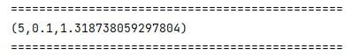

# 平方根误差：RMSE


# 新建Scala class单例对象

- 在OfflineRecommender项目下的main/scala 文件夹下新建scala class文件，命名为ALSTrainer，选择object

# Main函数

## 参数准备

```scala
// 定义表名
  val MONGODB_RATING_COLLECTION = "Rating"
  val USER_RESC = "UserResc"
  val PRODUCT_RESC = "ProductRecs"
  // Max-length of recommendation collection
  val USER_MAX_RECOMMENDATION = 20

  def main(args: Array[String]): Unit = {
    val config = Map(
      // 启用本地多线程
      "spark.cores" -> "local[*]",
      // 定义Mongo的uri
      "mongo.uri" -> "mongodb://localhost:27017/recommender",
      // 定义db
      "mongo.db" -> "recommender"
    )

    // 创建spark配置项
    val  sparkConf = new SparkConf().setMaster(config("spark.cores")).setAppName("OfflineRecommender")
    // 创建spark session
    val spark = SparkSession.builder().config(sparkConf).getOrCreate()

    import spark.implicits._

    // 创建隐式参数
    implicit val mongoConfig = MongoConfig(config("mongo.uri"),config("mongo.db"))
```


##  数据加载

- 需要从数据库中读取Rating数据

```scala
// 准备数据
    val ratingRDD = spark.read
      .option("uri", mongoConfig.uri)
      .option("collection", MONGODB_RATING_COLLECTION)
      .format("com.mongodb.spark.sql")
      .load()
      .as[ProductRating]
      .rdd
      .map(
        rating => (rating.userId, rating.productId, rating.score)
      )
      // .cache()的作用是将数据持久化在内存中
      .cache()
```


## 将数据切分为训练集和测试集

```scala
      val splits = ratingRDD.randomSplit(Array(0.8,0.2))
      val trainingRDD = splits(0)
      val testingRDD = splits(1)
```


## 定义输出最优参数函数（adjustALSParams）

```scala
    def adjustALSParams(trainingRDD: RDD[Rating], testingRDD: RDD[Rating]): Unit={
      // 将预选参数存放在数组中，然后遍历
      val result = for ( rank <- Array(5,10,20,50); lambda <- Array(1,0.1,0.01))
        yield {
          // 获得训练后的模型
          val model = ALS.train(trainingRDD,rank,10,lambda)
          // 获取rmse评分数据
          val rmse = getRMSE(model, testingRDD)
          // return to result
          ( rank, lambda, rmse)
        }
      // 按照rmse排序，并输出最优参数
      println(result.minBy(_._3))
    }
```


## 定义RMSE结果计算函数（getRMSE）

```scala
  def getRMSE(model: MatrixFactorizationModel, data: RDD[Rating]): Double = {
    // 首先根据model和data来进行UCE，但是在预测之前需要将data转换成predict函数所接受的形式
    val userProduct = data.map(
      item => (item.user, item.product)
    )
    // 使用userProduct进行预测
    val predictRating = model.predict(userProduct)

    // 需要将实际的rating值和预测rating值进行匹配配对，才能计算出正确的rmse值，所以需要使用productId以及userId来作为Key值，并且将它们进行连接即可
    val observed = data.map(
      item => ((item.user, item.product), item.rating)
    )
    val predict = predictRating.map(
      item => ((item.user, item.product), item.rating)
    )

    // 将两个表进行内连接, 之后进行求差值，然后平方，然后求均值最后开根号
    sqrt(
      observed.join(predict).map{
        case ((userId, productId), (actRating, preRating)) =>
          val err = actRating - preRating
          err * err
      }.mean()
    )
  }
```

# 整体代码

```scala
import OfflineRecommender.{MongoConfig, ProductRating}
import breeze.numerics.sqrt
import org.apache.spark.SparkConf
import org.apache.spark.mllib.recommendation.{ALS, MatrixFactorizationModel, Rating}
import org.apache.spark.rdd.RDD
import org.apache.spark.sql.SparkSession

object ALSTrainer {
    // 定义表名
    val MONGODB_RATING_COLLECTION = "Rating"
    val USER_RESC = "UserResc"
    val PRODUCT_RESC = "ProductRecs"
    // Max-length of recommendation collection
    val USER_MAX_RECOMMENDATION = 20

    def main(args: Array[String]): Unit = {
      val config = Map(
        // 启用本地多线程
        "spark.cores" -> "local[*]",
        // 定义Mongo的uri
        "mongo.uri" -> "mongodb://localhost:27017/recommender",
        // 定义db
        "mongo.db" -> "recommender"
      )

      // 创建spark配置项
      val  sparkConf = new SparkConf().setMaster(config("spark.cores")).setAppName("OfflineRecommender")
      // 创建spark session
      val spark = SparkSession.builder().config(sparkConf).getOrCreate()

      import spark.implicits._

      // 创建隐式参数
      implicit val mongoConfig = MongoConfig(config("mongo.uri"),config("mongo.db"))

      // 准备数据
      val ratingRDD = spark.read
        .option("uri", mongoConfig.uri)
        .option("collection", MONGODB_RATING_COLLECTION)
        .format("com.mongodb.spark.sql")
        .load()
        .as[ProductRating]
        .rdd
        .map(
          rating => Rating(rating.userId, rating.productId, rating.score)
        )
        // .cache()的作用是将数据持久化在内存中
        .cache()

      // 数据切分
      val splits = ratingRDD.randomSplit(Array(0.8,0.2))
      val trainingRDD = splits(0)
      val testingRDD = splits(1)

      // 获取最优的评分参数
      adjustALSParams(trainingRDD, testingRDD)

      spark.stop()

    }
    def adjustALSParams(trainingRDD: RDD[Rating], testingRDD: RDD[Rating]): Unit={
      // 将预选参数存放在数组中，然后遍历
      val result = for ( rank <- Array(5,10,20,50); lambda <- Array(1,0.1,0.01))
        yield {
          // 获得训练后的模型
          val model = ALS.train(trainingRDD,rank,10,lambda)
          // 获取rmse评分数据
          val rmse = getRMSE(model, testingRDD)
          // return to result
          ( rank, lambda, rmse)
        }
      // 按照rmse排序，并输出最优参数
      println("===============================================")
      println(result.minBy(_._3))
      println("===============================================")
    }

  // 计算rmse值
  def getRMSE(model: MatrixFactorizationModel, data: RDD[Rating]): Double = {
    // 首先根据model和data来进行UCE，但是在预测之前需要将data转换成predict函数所接受的形式
    val userProduct = data.map(
      item => (item.user, item.product)
    )
    // 使用userProduct进行预测
    val predictRating = model.predict(userProduct)

    // 需要将实际的rating值和预测rating值进行匹配配对，才能计算出正确的rmse值，所以需要使用productId以及userId来作为Key值，并且将它们进行连接即可
    val observed = data.map(
      item => ((item.user, item.product), item.rating)
    )
    val predict = predictRating.map(
      item => ((item.user, item.product), item.rating)
    )

    // 将两个表进行内连接, 之后进行求差值，然后平方，然后求均值最后开根号
    sqrt(
      observed.join(predict).map{
        case ((userId, productId), (actRating, preRating)) =>
          val err = actRating - preRating
          err * err
      }.mean()
    )
  }
}
```


# 结果展示



- 结果表明，在rank=5，lambda=0.1的时候，rmse值最小
- 这个结果和视频是一模一样的