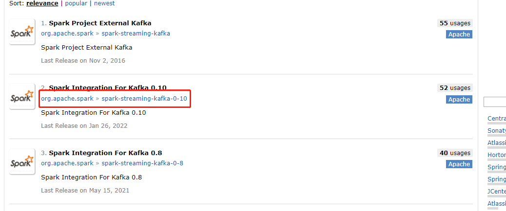

# 	建立实时推荐模块（OnlineRecommender）

## 在resources文件夹中添加log4j文件

## 在pom文件中添加如下依赖

```pom
<dependencies>
        <!-- Spark的依赖引入 -->
        <dependency>
            <groupId>org.apache.spark</groupId>
            <artifactId>spark-core_2.11</artifactId>
        </dependency>
        <dependency>
            <groupId>org.apache.spark</groupId>
            <artifactId>spark-sql_2.11</artifactId>
        </dependency>
        <dependency>
            <groupId>org.apache.spark</groupId>
            <artifactId>spark-streaming_2.11</artifactId>
        </dependency>
        <!-- 引入Scala -->
        <dependency>
            <groupId>org.scala-lang</groupId>
            <artifactId>scala-library</artifactId>
        </dependency>

        <!-- 加入MongoDB的驱动 -->
        <!-- 用于代码方式连接MongoDB -->
        <dependency>
            <groupId>org.mongodb</groupId>
            <artifactId>casbah-core_2.11</artifactId>
            <version>${casbah.version}</version>
        </dependency>
        <!-- 用于Spark和MongoDB的对接 -->
        <dependency>
            <groupId>org.mongodb.spark</groupId>
            <artifactId>mongo-spark-connector_2.11</artifactId>
            <version>${mongodb-spark.version}</version>
        </dependency>

        <!-- redis -->
        <dependency>
            <groupId>redis.clients</groupId>
            <artifactId>jedis</artifactId>
            <version>2.9.1</version>
        </dependency>

        <!-- kafka -->
        <dependency>
            <groupId>org.apache.kafka</groupId>
            <artifactId>kafka-clients</artifactId>
            <version>0.10.2.2</version>
        </dependency>
<!--        <dependency>-->
<!--            <groupId>org.apache.spark</groupId>-->
<!--            <artifactId>spark-streaming-kafka-0-10_2.12</artifactId>-->
<!--            <version>2.4.8</version>-->
<!--        </dependency>-->
        <dependency>
            <groupId>org.apache.spark</groupId>
            <artifactId>spark-streaming-kafka-0-10_2.11</artifactId>
            <version>2.1.1</version>
        </dependency>

    </dependencies>
```

### 问题1

- 在依赖spark-streaming-kafka出现了问题。一开始我直接复制了源代码，但是出错了，我选择了从[maven仓库](https://mvnrepository.com/artifact/org.apache.spark)中去复制，但是我选择了第一个，并且再也没报错
- 但是后来发现**LocationStrategies.PreferConsistent**无法使用，后来发现【[spark streaming消费kafka maven依赖选择_zhaolq1024的博客-CSDN博客](https://blog.csdn.net/zhaolq1024/article/details/85685189)】，spark-streaming-kafka的依赖有三种，而我们用的是这个。
  - 

- 参考网站说，spark-streaming-kafka和spark-streaming-kafka-0-8中代码是一样的。并且作者推荐我们使用spark-streaming-kafka-0-10
  - 
  - 

### 问题2

- 在我更改好依赖之后，在主界面中依赖不再报错，但是在右侧中还是又红色的下波浪线，后来找到解决方案[IDEA，MAVEN项目导入后依赖出现红色波浪线 - 简书 (jianshu.com)](https://www.jianshu.com/p/2cae6b775b74)
- 打开setting——>Compiler——>勾选Build Project automatically

### 问题3

- 虽然导入了0-10版本的包，但是最后还是要要求kafka依赖版本和spark的版本一致
  - 0-10包的正确网址：[Maven Repository: org.apache.spark » spark-streaming-kafka-0-10_2.11 » 2.1.1 (mvnrepository.com)](https://mvnrepository.com/artifact/org.apache.spark/spark-streaming-kafka-0-10_2.11/2.1.1)
- 我一开始导入的kafka依赖版本是2.12，而spark版本是2.11，就报错了
  - java.lang.NoSuchMethodError: org.apache.spark.internal.Logging.$init$(Lorg/apache/spark/internal/Loging;
- [java.lang.NoSuchMethodError: org.apache.spark.internal.Logging.$init$(Lorg/apache/spark/internal/Log..._weixin_30511039的博客-CSDN博客](https://blog.csdn.net/weixin_30511039/article/details/94990043)

## 创建scala class

- 将src/main/java文件夹名称改为scala
- 创建scala文件夹下创建scala class 文件，创建为单例对象（object），命名为OnlineRecommender

# 定义样例类

- 需要的样例类：
  - MongoDB连接配置样例类
  - 推荐样例类，格式为 （userId，（productId，score））
  - 连接助手对象，帮助Redis和MongoDB的连接

```scala
  /**
   * 定义一个连接助手对象，建立道Redis和MongoDB的连接
   */
  object ConnHelper extends  Serializable{
    // 定义懒变量，使用的时候才初始化
    lazy val jedis = new Jedis("localhost")
    lazy val mongoClient = MongoClient(MongoClientURI("mongodb://localhost:27017/recommender"))
  }

  /**
   * MongoDB连接配置样例类
   * @param uri
   * @param db
   */
  case class MongoConfig(uri: String, db: String);

  /**
   * 标准推荐样例类
   * @param productId
   * @param score
   */
  case class Recommendation(productId: Int, score: Double);

  /**
   * 用户推荐样例类
   * @param userId
   * @param recs
   */
  case class UserRecs(userId: Int, recs: Seq[Recommendation]);

  /**
   * 商品相似度列表
   * @param productId
   * @param recs
   */
  case class ProductRecs(productId: Int, recs: Seq[Recommendation]);
```

 

# OnlineRecommender编写

## 定义常量和表名

```scala
  // 保留实时推荐结果
  val STREAM_RECS = "StreamRecs"
  // 读取相似度矩阵表
  val PRODUCT_RECS = "ProductRecs"
  // 从Redis中选取评分的数量
  val MAX_USER_RATING_NUM = 20
  // 候选商品列表长度
  val MAX_SIM_PRODUCTS_NUM = 20
  // 评分数据，从数据库里读取
  val MONGO_RATING_COLLECTION =  "Rating"
```

## Main-连接数据库配置项

```scala
    val config = Map(
      // 启用本地多线程
      "spark.cores" -> "local[*]",
      // 定义Mongo的uri
      "mongo.uri" -> "mongodb://localhost:27017/recommender",
      // 定义db
      "mongo.db" -> "recommender"
      // kafka
      "kafka.topic" -> "recommender"
    )

    // 创建kafka配置参数
    val kafkaParam = Map(
      "bootstrap.servers" -> "localhost:9092",
      "key.deserializer" -> classOf[StringDeserializer],
      "value.deserializer" -> classOf[StringDeserializer],
      "group.id" -> "recommender",
      "auto.offset.reset" -> "latest"
    )
```

## 创建spark session以及其他设置

```scala
    // 创建spark配置项
    val  sparkConf = new SparkConf().setMaster(config("spark.cores")).setAppName("OnlineRecommender")
    // 创建spark session
    val spark = SparkSession.builder().config(sparkConf).getOrCreate()
    // 创建流式计算对象
    val sc = spark.sparkContext
    val ssc = new StreamingContext(sc, Seconds(2))

    import spark.implicits._
    // 创建隐式参数
    implicit val mongoConfig = MongoConfig(config("mongo.uri"),config("mongo.db"))
```


## 从MongoDB加载数据并广播

- 加载相似度矩阵
- 为了方便后期的数据查询，将读取的数据转换成Key/value形式，而且是一个双层key/value形式

```scala
    // 加载数据，加载相似度矩阵，把该数据广播出去
    val simProductsMatrix = spark.read
      .option("uri", mongoConfig.uri)
      .option("collection",PRODUCT_RECS)
      .format("com.mongodb.spark.sql")
      .load()
      .as[ProductRecs]
      .rdd
      // 将数据转换成{productId,{productId, score}[,...]}的形式
      .map{
        item => (
          item.productId,
          item.recs
            // 将数据转换成元组形式，才能调用toMap函数
            .map(x => (x.productId, x.score))
            // 转换成Map形式
            .toMap
        )
      }
      // 此时的数据格式为：RDD[Int, Map[Int, Double]]
      // toMap是RDD数据独有的功能，将RDD数据转换成Key/Value形式
      .collectAsMap()

    // 将数据进行广播
    val simProductsMatrixBC = sc.broadcast(simProductsMatrix)
```

## kafkaStream创建

- kafka Stream的作用就是从Redis中读取数据

```scala
    // 创建一个DStream
    val kafkaStream = KafkaUtils.createDirectStream[String, String](
      ssc,
      LocationStrategies.PreferConsistent,
      ConsumerStrategies.Subscribe[String, String](Array(config("kafka.topic")),kafkaParam)
    )
    // 对kafka stream进行处理，产生评分流。从kafka Stream 进来的数据的格式是：UserId|ProductId|score|timestamp
    val ratingStream = kafkaStream.map{
      msg =>
        val attr = msg.value().split("|")
        (attr(0).toInt, attr(1).toInt, attr(2).toDouble, attr(3).toInt)
    }
```

## 核心算法部分

 通过kafka读取到的用户最近评分以及商品相似度数据，来计算商品推荐列表

1. 从Redis取出用户最近的评分，保存成数组形式Array[(productId, score)]
2. 从相似度矩阵中获取当前商品最相似的商品列表，作为备选列表，保存成数组Array[productId]
3. 计算每个商品的推荐优先级，得到当前用户的实时推荐列表，保存成数组Array[(productId,score)]
4. 吧推荐列表保存到MongoDB

```scala
          // 获取用户最近评分数据，定义函数 getUserRecentlyRating，
            // MAX_USER_RATING_NUM：限制数量
            // userId：因为是要找到当前用户的最近评分，所以要传进当前用户的id
            // ConnHelper.jedis：Redis相关客户端，不是很清楚
          val userRecentlyRating = getUserRecentlyRating(MAX_USER_RATING_NUM, userId, ConnHelper.jedis)

          // 获取当前商品的候选商品列表
            // MAX_SIM_PRODUCTS_NUM：限制候选商品的数量
            // productId：方便通过相似度矩阵确定当前商品的候选商品数量
            // userId：因为存在用户已经评分过的数据，所以需要通过用户Id去掉那些评分过的数据
            // simProductsMatrixBC.value: 被广播的商品相似度矩阵数据
          val candidateProducts = getTopSimProducts(MAX_SIM_PRODUCTS_NUM, productId, userId, simProductsMatrixBC.value)

          // 计算备选商品推荐优先级
            // candidateProducts：模型需要候选商品列表
            // userRecentlyRating：模型需要用户最近评分数据
            // simProductsMatrixBC：模型还需要用到商品相似度数据
          val streamRecs = computeProductScore(candidateProducts, userRecentlyRating, simProductsMatrixBC)

          // 将数据写回到MongoDB
          // userId：需要确定被更新的是哪个用户的商品推荐列表
          // streamRecs：需要被写回的数据
          saveDataToMongoDB(userId, streamRecs)
```

## getUserRecentlyRating函数实现

- 该函数的作用：根据kafka读取到的当前用户，从Redis中读取出当前用户最近的评分数据

```scala
  import scala.collection.JavaConversions._
  def getUserRecentlyRating(num: Int, userId: Int, jedis: Jedis): Array[(Int, Double)] = {
    // 从Redis中的用户评分队列里获取评分数据。返回的是一个list，键名：uid:USERID，值名:PRODUCTID:SCORE
    // lrange函数：从jedis中读取指定键名的数据，同时指定范围
    jedis.lrange("userId:"+userId.toString, 0, num)
      .map{
        item =>
          val attr = item.split("\\:")
          (attr(0).trim.toInt, attr(1).trim.toDouble)
      }.toArray
  }
```


## getTopSimProducts函数

- 获取商品相似度列表，过滤掉当前用户已经评价过的商品

```scala
  def getTopSimProducts(num: Int, productId: Int, userId: Int, simProducts: scala.collection.Map[Int, scala.collection.immutable.Map[Int, Double]])
                       (implicit mongoConfig: MongoConfig): Array[Int] = {
    // 获取商品相似列表
    val allSimProducts = simProducts(productId).toArray

    // 获取用户评价过的商品id
    // 从数据库中读取评分数据
    val ratingCollection = ConnHelper.mongoClient(mongoConfig.db)(MONGO_RATING_COLLECTION)
    // 取出当前用户的评分数据，取出productId即可，不需要评分
    val ratingExists = ratingCollection.find(MongoDBObject("userId"->userId))
      .toArray
      .map{item =>
        item.get("productId").toString.toInt
      }
    // 对比两个数据集allSimProducts，ratingExists。寻找出allSimProducts不包含ratingExists的数据
    allSimProducts
      // 过滤掉既在allSimProducts中，又在ratingExists中的数据
      .filter(x => !ratingExists.contains(x._1))
      .sortWith(_._2> _._2)
      // 取出指定数量的数据
      .take(num)
      // 只需要productId
      .map(x=>x._1)
  }
```

## 定义computeProductScore函数

- 计算商品的推荐评分

```scala
  def computeProductScore(candidateProducts: Array[Int],
                          userRecentlyRatings: Array[(Int, Double)],
                          simProducts: scala.collection.Map[Int, scala.collection.immutable.Map[Int, Double]])
  :Array[(Int,Double)] = {
    // 定义一个可变数组存储基础评分，格式：Array[(Int, Double)]
    val baseScores = ArrayBuffer[(Int, Double)]()
    // 因为统计高评分商品数量和低评分商品数量
    val increNum = mutable.HashMap[Int, Int]()
    val descNum = mutable.HashMap[Int, Int]()

    // 遍历每一个候选商品的推荐度
    for (candidateProduct <- candidateProducts; userRecentlyRating <- userRecentlyRatings){
      // 从相似度矩阵中取出当前候选商品和当前商品的相似度
      val simScore = getProductSimScore(candidateProduct, userRecentlyRating._1, simProducts)
      // 只有满足评分的数据才会被计算在内
      if (simScore > 0.4){
        // 按照公式进行加权计算，得到基础评分。这里的+=方法是scala.collection.mutable.ArrayBuffer里独有的，相当于Python的append
        baseScores += ((candidateProduct, userRecentlyRating._2))
        if (userRecentlyRating._2 > 3){
          // 当前被评价商品属于高分评价商品
          // getOrDefault() 方法获取指定 key 对应对 value，如果找不到 key ，则返回设置的默认值。
          descNum(candidateProduct) = descNum.getOrDefault(candidateProduct,0) + 1
        }else{
          // 当前被评价商品属于低分评价商品
        }
      }
    }

    // 根据公式计算所有的推荐优先级，
    baseScores.groupBy(_._1).map{
      case (productId, scoreList) => (
        (productId, scoreList.map(_._2).sum / scoreList.length + log(increNum.getOrDefault(productId, 1) - log(descNum.getOrDefault(productId, 1))))
        )
    }
      .toArray
      // 只有Array才有排序函数
      .sortWith(_._2>_._2)
  }
```


## 定义getProductSimScore函数

- 获取商品相似度评分
- 这部分用了模式匹配，暂时看不懂

```scala
  def getProductSimScore(candidateProduct: Int, userRecentlyRatingProduct: Int, simProducts: scala.collection.Map[Int, Map[Int, Double]])
  :Double = {
    simProducts.get(candidateProduct) match {
      case Some(sims) => sims.get(userRecentlyRatingProduct) match {
        case Some(score) => score
        case None => 0.0
      }
      case None => 0.0
    }
  }
```

## 自定义log函数

- 为了方便我们计算不同底数的log，需要使用数学的log换底公式

```scala
  def log(i: Int):Double ={
    // 底数
    val N = 10
    math.log(i)/math.log(N)
  }
```


## 定义saveDataToMongoDB函数

- 作用是将(userId,stremRecs)格式的数据写回到MongoDB

```scala
  def saveDataToMongoDB(userId: Int, streamRecs: Array[(Int, Double)])(implicit mongoConfig: MongoConfig): Unit = {
    // 拿到STREAM_RECS数据库的操作权限
    val streamRecsCollection = ConnHelper.mongoClient(mongoConfig.db)(STREAM_RECS)
    // 按照userId查询数据并更新
    streamRecsCollection.findAndRemove(MongoDBObject("userId" -> userId))
    streamRecsCollection.insert(MongoDBObject("userId" -> userId, "recs" -> streamRecs.map(x => MongoDBObject("productId" -> x._1, "score" -> x._2))))
  }
```

# 整体代码

```scala

import com.mongodb.casbah.commons.MongoDBObject
import com.mongodb.casbah.{MongoClient, MongoClientURI}
import org.apache.kafka.common.serialization.StringDeserializer
import org.apache.spark.SparkConf
import org.apache.spark.sql.SparkSession
import org.apache.spark.streaming.{Seconds, StreamingContext}
import redis.clients.jedis.Jedis
import org.apache.spark.streaming.kafka010._
import org.apache.spark.streaming.kafka010.LocationStrategies.PreferConsistent
import org.apache.spark.streaming.kafka010.ConsumerStrategies.Subscribe

import scala.collection.mutable
import scala.collection.mutable.ArrayBuffer


/**
 * 定义一个连接助手对象，建立道Redis和MongoDB的连接
 */
object ConnHelper extends  Serializable{
  // 定义懒变量，使用的时候才初始化
  lazy val jedis = new Jedis("localhost")
  lazy val mongoClient = MongoClient(MongoClientURI("mongodb://localhost:27017/recommender"))
}

/**
 * MongoDB连接配置样例类
 * @param uri
 * @param db
 */
case class MongoConfig(uri: String, db: String);

/**
 * 标准推荐样例类
 * @param productId
 * @param score
 */
case class Recommendation(productId: Int, score: Double);

/**
 * 用户推荐样例类
 * @param userId
 * @param recs
 */
case class UserRecs(userId: Int, recs: Seq[Recommendation]);

/**
 * 商品相似度列表
 * @param productId
 * @param recs
 */
case class ProductRecs(productId: Int, recs: Seq[Recommendation]);

object OnlineRecommender {
  /**
   * 定义常量
   */
  // 保留实时推荐结果
  val STREAM_RECS = "StreamRecs"
  // 读取相似度矩阵表
  val PRODUCT_RECS = "ProductRecs"
  // 从Redis中选取评分的数量
  val MAX_USER_RATING_NUM = 20
  // 候选商品列表长度
  val MAX_SIM_PRODUCTS_NUM = 20
  // 评分数据，从数据库里读取
  val MONGO_RATING_COLLECTION =  "Rating"

  /**
   * Main函数
   */
  def main(args: Array[String]): Unit = {
    /**
     * 连接配置项，包含MongoDB、kafka
     */
    val config = Map(
      // 启用本地多线程
      "spark.cores" -> "local[*]",
      // 定义Mongo的uri
      "mongo.uri" -> "mongodb://localhost:27017/recommender",
      // 定义db
      "mongo.db" -> "recommender",
      // kafka
      "kafka.topic" -> "recommender"
    )

    // 创建kafka配置参数
    val kafkaParam = Map(
      "bootstrap.servers" -> "localhost:9092",
      "key.deserializer" -> classOf[StringDeserializer],
      "value.deserializer" -> classOf[StringDeserializer],
      "group.id" -> "recommender",
      "auto.offset.reset" -> "latest"
    )

    // 创建spark配置项
    val  sparkConf = new SparkConf().setMaster(config("spark.cores")).setAppName("OnlineRecommender")
    // 创建spark session
    val spark = SparkSession.builder().config(sparkConf).getOrCreate()
    // 创建流式计算对象
    val sc = spark.sparkContext
    val ssc = new StreamingContext(sc, Seconds(2))

    import spark.implicits._
    // 创建隐式参数
    implicit val mongoConfig = MongoConfig(config("mongo.uri"),config("mongo.db"))

    /**
     * 加载商品相似度矩阵数据
     */
    // 加载数据，加载相似度矩阵，把该数据广播出去
    val simProductsMatrix = spark.read
      .option("uri", mongoConfig.uri)
      .option("collection",PRODUCT_RECS)
      .format("com.mongodb.spark.sql")
      .load()
      .as[ProductRecs]
      .rdd
      // 将数据转换成{productId,{productId, score}[,...]}的形式
      .map{
        item => (
          item.productId,
          item.recs
            // 将数据转换成元组形式，才能调用toMap函数
            .map(x => (x.productId, x.score))
            // 转换成Map形式
            .toMap
        )
      }
      // 此时的数据格式为：RDD[Int, Map[Int, Double]]
      // toMap是RDD数据独有的功能，将RDD数据转换成Key/Value形式
      .collectAsMap()

    // 将数据进行广播
    val simProductsMatrixBC = sc.broadcast(simProductsMatrix)

    /**
     * kafka
     */
    // 创建一个DStream
    val kafkaStream = KafkaUtils.createDirectStream[String, String](
      ssc,
      LocationStrategies.PreferConsistent,
      ConsumerStrategies.Subscribe[String, String](Array(config("kafka.topic")),kafkaParam)
    )
    // 对kafka stream进行处理，产生评分流。从kafka Stream 进来的数据的格式是：UserId|ProductId|score|timestamp
    val ratingStream = kafkaStream.map{
      msg =>
        val attr = msg.value().split("\\|")
        (attr(0).toInt, attr(1).toInt, attr(2).toDouble, attr(3).toInt)
    }

    /**
     * @核心计算部分
     */
    // foreachRDD函数取的数据是一段时间內的一组RDD数据
    ratingStream.foreachRDD{
          // foreach函数取得是每一条数据，格式是：UserId|ProductId|score|timestamp
      rdds => rdds.foreach{
        case (userId, productId, score, timeStamp) =>
          println("rating data coming!!! >>>>>>>>>>>>>>>>>>>>>>>>>>>>>>>>>>>")

          // TODO: 开始进行数据处理
          // 获取用户最近评分数据，定义函数 getUserRecentlyRating，
            // MAX_USER_RATING_NUM：限制数量
            // userId：因为是要找到当前用户的最近评分，所以要传进当前用户的id
            // ConnHelper.jedis：Redis相关客户端，不是很清楚
          val userRecentlyRating = getUserRecentlyRating(MAX_USER_RATING_NUM, userId, ConnHelper.jedis)

          // 获取当前商品的候选商品列表
            // MAX_SIM_PRODUCTS_NUM：限制候选商品的数量
            // productId：方便通过相似度矩阵确定当前商品的候选商品数量
            // userId：因为存在用户已经评分过的数据，所以需要通过用户Id去掉那些评分过的数据
            // simProductsMatrixBC.value: 被广播的商品相似度矩阵数据
          val candidateProducts = getTopSimProducts(MAX_SIM_PRODUCTS_NUM, productId, userId, simProductsMatrixBC.value)

          // 计算备选商品推荐优先级
            // candidateProducts：模型需要候选商品列表
            // userRecentlyRating：模型需要用户最近评分数据
            // simProductsMatrixBC：模型还需要用到商品相似度数据
          val streamRecs = computeProductScore(candidateProducts, userRecentlyRating, simProductsMatrixBC.value)

          // 将数据写回到MongoDB
          // userId：需要确定被更新的是哪个用户的商品推荐列表
          // streamRecs：需要被写回的数据
          saveDataToMongoDB(userId, streamRecs)
      }
    }

    // 启动streaming
    ssc.start()
    println("Streaming Started!!! >>>>>>>>>>>>>>>>>>>>>>>>>>>>>>>>>>>")
    // 等待用户终止或者异常终止
    ssc.awaitTermination()
  }

  /**
   * @getUserRecentlyRating：读取用户最近评分数据
   * @param num
   * @param userId
   * @param jedis
   * @return
   */
  // 导入JavaConversions._包：lrange返回的是一个java类型的List，所以需要使用该转换工具
  import scala.collection.JavaConversions._
  def getUserRecentlyRating(num: Int, userId: Int, jedis: Jedis): Array[(Int, Double)] = {
    // 从Redis中的用户评分队列里获取评分数据。返回的是一个list，键名：uid:USERID，值名:PRODUCTID:SCORE
    // lrange函数：从jedis中读取指定键名的数据，同时指定范围
    jedis.lrange("userId:"+userId.toString, 0, num)
      .map{
        item =>
          val attr = item.split("\\:")
          (attr(0).trim.toInt, attr(1).trim.toDouble)
      }.toArray
  }

  /**
   * @获取当前商品的商品相似列表，同时删除该用户评价过的商品
   * @param num
   * @param productId
   * @param userId
   * @param simProducts
   * @param mongoConfig
   * @return
   */
  def getTopSimProducts(num: Int, productId: Int, userId: Int, simProducts: scala.collection.Map[Int, scala.collection.immutable.Map[Int, Double]])
                       (implicit mongoConfig: MongoConfig): Array[Int] = {
    // 获取商品相似列表
    val allSimProducts = simProducts(productId).toArray

    // 获取用户评价过的商品id
    // 从数据库中读取评分数据
    val ratingCollection = ConnHelper.mongoClient(mongoConfig.db)(MONGO_RATING_COLLECTION)
    // 取出当前用户的评分数据，取出productId即可，不需要评分
    val ratingExists = ratingCollection.find(MongoDBObject("userId"->userId))
      .toArray
      .map{item =>
        item.get("productId").toString.toInt
      }
    // 对比两个数据集allSimProducts，ratingExists。寻找出allSimProducts不包含ratingExists的数据
    allSimProducts
      // 过滤掉既在allSimProducts中，又在ratingExists中的数据
      .filter(x => !ratingExists.contains(x._1))
      .sortWith(_._2> _._2)
      // 取出指定数量的数据
      .take(num)
      // 只需要productId
      .map(x=>x._1)
  }

  /**
   * @计算每个候选商品的推荐评分
   * @param candidateProducts
   * @param userRecentlyRating
   * @param simProducts
   * @return
   */
  def computeProductScore(candidateProducts: Array[Int],
                          userRecentlyRatings: Array[(Int, Double)],
                          simProducts: scala.collection.Map[Int, scala.collection.immutable.Map[Int, Double]])
  :Array[(Int,Double)] = {
    // 定义一个可变数组存储基础评分，格式：Array[(Int, Double)]
    val baseScores = ArrayBuffer[(Int, Double)]()
    // 因为统计高评分商品数量和低评分商品数量
    val increNum = mutable.HashMap[Int, Int]()
    val descNum = mutable.HashMap[Int, Int]()

    // 遍历每一个候选商品的推荐度
    for (candidateProduct <- candidateProducts; userRecentlyRating <- userRecentlyRatings){
      // 从相似度矩阵中取出当前候选商品和当前商品的相似度
      val simScore = getProductSimScore(candidateProduct, userRecentlyRating._1, simProducts)
      // 只有满足评分的数据才会被计算在内
      if (simScore > 0.4){
        // 按照公式进行加权计算，得到基础评分。这里的+=方法是scala.collection.mutable.ArrayBuffer里独有的，相当于Python的append
        baseScores += ((candidateProduct, userRecentlyRating._2))
        if (userRecentlyRating._2 > 3){
          // 当前被评价商品属于高分评价商品
          // getOrDefault() 方法获取指定 key 对应对 value，如果找不到 key ，则返回设置的默认值。
          descNum(candidateProduct) = descNum.getOrDefault(candidateProduct,0) + 1
        }else{
          // 当前被评价商品属于低分评价商品
        }
      }
    }

    // 根据公式计算所有的推荐优先级，
    baseScores.groupBy(_._1).map{
      case (productId, scoreList) => (
        (productId, scoreList.map(_._2).sum / scoreList.length + log(increNum.getOrDefault(productId, 1)) - log(descNum.getOrDefault(productId, 1)))
        )
    }
      .toArray
      // 只有Array才有排序函数
      .sortWith(_._2>_._2)
  }

  /**
   * @寻找当前候选商品和当前被评价商品的相似度
   * @param candidateProduct
   * @param userRecentlyRating
   * @param simProducts
   */
  // 这块用了模式匹配看不懂
  def getProductSimScore(candidateProduct: Int, userRecentlyRatingProduct: Int, simProducts: scala.collection.Map[Int, Map[Int, Double]])
  :Double = {
    simProducts.get(candidateProduct) match {
      case Some(sims) => sims.get(userRecentlyRatingProduct) match {
        case Some(score) => score
        case None => 0.0
      }
      case None => 0.0
    }
  }

  /**
   * @换底log函数，以10为底
   * @param i
   * @return
   */
  def log(i: Int):Double ={
    // 底数
    val N = 10
    math.log(i)/math.log(N)
  }

  def saveDataToMongoDB(userId: Int, streamRecs: Array[(Int, Double)])(implicit mongoConfig: MongoConfig): Unit = {
    // 拿到STREAM_RECS数据库的操作权限
    val streamRecsCollection = ConnHelper.mongoClient(mongoConfig.db)(STREAM_RECS)
    // 按照userId查询数据并更新
    streamRecsCollection.findAndRemove(MongoDBObject("userId" -> userId))
    streamRecsCollection.insert(MongoDBObject("userId" -> userId, "recs" -> streamRecs.map(x => MongoDBObject("productId" -> x._1, "score" -> x._2))))
  }

}
```


# 实时模块测试

## 准备

1. 启动zookeeper服务

2. 启动kafka服务

3. 启动MongoDB服务和客户端

4. 启动Redis服务和客户端

5. 在Redis中插入一组用户的评分数据，这里就插入用户4867的评分数据。因为Redis插入数据时，先插入的在下边，所以在MongoDB中查询数据的时候就将旧的数据放在上边，通过升序排序展示出来，然后一条一条插入进去

   - MongoDB：4867相关数据

   - Redis插入数据，通过

     ```redis
     lpush userId:4867 value
     ```

     格式插入语句

     

## 运行代码

- 在运行之前先将log4j的输出级别更改为warn


- 然后运行代码，出现如下内容，表示运行成功，等待生产者产生数据，然后从消费者数据


- 创建一个kafka生产者，主题设置为recommender

  ```cmd
  .\bin\windows\kafka-console-producer.bat --broker-list localhost:9092 --topic recommender
  ```


- 然后根据我们之前定的输入数据的格式


- 我们输入数据：4867|8195|4.0|1644895217
  - 这里4867是用户id。因为我们只在Redis里存上了用户4867的评分数据，所以我们在这里只可以输入4867的id
  - 8195是商品id
  - 4.0是该用户打的分
  - 1644895217是以秒为单位的时间戳

- 然后我们就可以在idea的控制台发现打印了一条新的语句


- 在MongoDB里查看表，可以发现多了一个表：StreamRecs


- 查询该表，可以发现，表里只有一条数据，针对用户4867的数据。因为该表的存储结构本来就是一个用户一条数据，而我们只测试了一个用户，所以只有一条数据


# 实时系统联调

