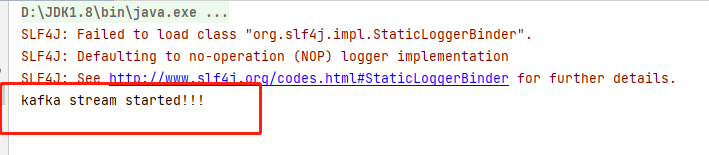

我们的系统实时推荐的数据流向是：业务系统 -> 日志 -> flume 日志采集 -> kafka streaming数据清洗和预处理 -> spark streaming 流式计算。

# 新建模块KafkaStreaming

- 该模块的主要作用是让kafka处理来自于flume的log的数据，将数据处理成我们需要的格式。

- 这里的作用就相当于我们上一节测试的时候输入的数据，不过我们输入的数据格式很正确，不需要定义流程来裁剪数据。

- 但是log方向来的数据格式可就不正确了，需要这个模块将数据进行裁剪。

- log数据是由flume监控某个文件得来的

- 命名为KafkaStreaming

- 需要的依赖

  ```pom
  <dependencies>
      <dependency>
          <groupId>org.apache.kafka</groupId>
          <artifactId>kafka-streams</artifactId>
          <version>0.10.2.1</version>
      </dependency>
      <dependency>
          <groupId>org.apache.kafka</groupId>
          <artifactId>kafka-clients</artifactId>
          <version>0.10.2.1</version>
      </dependency>
  </dependencies>
  
  <build>
      <finalName>kafkastream</finalName>
      <plugins>
          <plugin>
              <groupId>org.apache.maven.plugins</groupId>
              <artifactId>maven-assembly-plugin</artifactId>
              <configuration>
                  <archive>
                      <manifest>
                          <mainClass>com.atguigu.kafkastream.Application</mainClass>
                      </manifest>
                  </archive>
                  <descriptorRefs>
                      <descriptorRef>jar-with-dependencies</descriptorRef>
                  </descriptorRefs>
              </configuration>
              <executions>
                  <execution>
                      <id>make-assembly</id>
                      <phase>package</phase>
                      <goals>
                          <goal>single</goal>
                      </goals>
                  </execution>
              </executions>
          </plugin>
      </plugins>
  </build>
  ```

- 复制log4j文件

- 在src/main/java/下创建java class文件，命名为Application

# Main函数编写

## 定义用到的配置参数

```java
        // 定义kafka地址端口
        String brokers = "localhost:9092";
        // 定义zookeeper地址端口
        String zookeeper = "localhost:2181";
        // 定义输入输出的topic
        String from = "log";
        String to = "recommender";
        // 定义 kafka streaming 的配置参数
        Properties settings = new Properties();
        settings.put(StreamsConfig.APPLICATION_ID_CONFIG, "logfilter");
        settings.put(StreamsConfig.BOOTSTRAP_SERVERS_CONFIG, brokers);
        settings.put(StreamsConfig.ZOOKEEPER_CONNECT_CONFIG, zookeeper);
        // 创建 kafka stream 配置对象
        StreamsConfig config = new StreamsConfig(settings);
```

## 定义拓扑构建器

```java
        TopologyBuilder builder = new TopologyBuilder();
        builder.addSource("SOURCE", from)
                .addProcessor("PROCESSOR", () -> new LogPRocessor(), "SOURCE")
                .addSink("SINK", to, "PROCESSOR");
```

- 这里的add函数，第一项是名称，可以随便起
- 第二项是数据源，但是addProcessor的第二项是处理流程
- 第三项是父名称，也就是前一项处理的名称

## 创建kafka stream

```java
        KafkaStreams kafkaStreams = new KafkaStreams(builder, config);

        kafkaStreams.start();

        System.out.println("kafka stream started!!!");
```

- 这里创建KafkaStream对象时，第一个参数是拓扑构建器，第二个参数是配置参数

# 定义LogProcessor类

- 在java目录下新建一个java class文件，命名为LogProcessor。
- 该类实现Processor类，类型为<byte[],byte[]>

```java
import org.apache.kafka.streams.processor.Processor;
import org.apache.kafka.streams.processor.ProcessorContext;

import java.nio.charset.StandardCharsets;
import java.util.stream.Stream;

public class LogPRocessor implements Processor<byte[], byte[]> {
    // 定义Processor上下文对象
    private ProcessorContext context;
    @Override
    public void init(ProcessorContext processorContext) {
        // 初始化上下文
        this.context = processorContext;
    }

    @Override
    public void process(byte[] dummt, byte[] line) {
        // dummy 是key， line 是数组，需要处理的数据
        // 核心处理流程:
        String input = new String(line);
        // 提取数据，以一个固定的前缀提取日志信息里的数据: PRODUCT_RATING_PREFIX:
        if (input.contains("PRODUCT_RATING_PREFIX")){
            System.out.println("product rating comming!!!" + input);
            input = input.split("PRODUCT_RATING_PREFIX:")[1].trim();
            context.forward("logProcessor".getBytes(), input.getBytes());
        }
    }

    @Override
    public void punctuate(long l) {

    }

    @Override
    public void close() {

    }
}
```

# 测试

- 启动zookeeper和kafka服务器之后，运行代码
- 出现如下内容表示运行成功



# 配置kafka的数据源flume

- 在flume安装目录下的conf文件夹下新建配置文件log-kafka.properties，并写入如下内容
- 下面配置文件内容主要是连接kafka和定义监控的数据文件

```
agent.sources = exectail
agent.channels = memoryChannel
agent.sinks = kafkasink

# For each one of the sources, the type is defined
agent.sources.exectail.type = exec
# 下面这个路径是需要收集日志的绝对路径，改为自己的日志目录
agent.sources.exectail.command = tail -f  D:/file/JavaFile/ECommenderSystem/businessServer/src/main/log/agent.log
agent.sources.exectail.interceptors=i1
agent.sources.exectail.interceptors.i1.type=regex_filter
# 定义日志过滤前缀的正则
agent.sources.exectail.interceptors.i1.regex=.+PRODUCT_RATING_PREFIX.+
# The channel can be defined as follows.
agent.sources.exectail.channels = memoryChannel

# Each sink's type must be defined
agent.sinks.kafkasink.type = org.apache.flume.sink.kafka.KafkaSink
agent.sinks.kafkasink.kafka.topic = log
agent.sinks.kafkasink.kafka.bootstrap.servers = localhost:9092
agent.sinks.kafkasink.kafka.producer.acks = 1
agent.sinks.kafkasink.kafka.flumeBatchSize = 20

#Specify the channel the sink should use
agent.sinks.kafkasink.channel = memoryChannel

# Each channel's type is defined.
agent.channels.memoryChannel.type = memory

# Other config values specific to each type of channel(sink or source)
# can be defined as well
# In this case, it specifies the capacity of the memory channel
agent.channels.memoryChannel.capacity = 10000
```

- 在我们启动flume的时候，需要加载该配置文件

# 配置项目web网页和启动

关于Tomcat插件的学习网站

[使用tomcat7-maven-plugin - M野望 - 博客园 (cnblogs.com)](https://www.cnblogs.com/mozisss/p/10233366.html)

## 配置项目

- 首先拿到项目代码，结构如下

- 我们需要将里边的businessServer复制到我们的项目中

- 然后打开businessServer的pom文件，我们需要修改里边的一些内容

  - parent标签下的artifactId改成我们自己项目的名称，然后是groupId改为org.example

  - 在properties标签里添加<project.build.sourceEncoding>UTF-8</project.build.sourceEncoding>防止提出警告说File encoding has not been set

  - 最后也是最重要的，在管理Tomcat7插件的代码中，在configuration里添加这一句，参考网址【[(29条消息) 使用tomcat插件时候出现Skipping non-war project问题_青茶cc的博客-CSDN博客](https://blog.csdn.net/weixin_44995668/article/details/108932399)】

    ```
    <ignorePackaging>true</ignorePackaging>
    ```

    - 如果不添加，会提示
    - 并且会产生连带错误，把人带错方向

- 如果出现pom文件被忽略的情况，参考了网站【[pom文件被忽略_熊二吃屁的博客-CSDN博客_已忽略的pom](https://blog.csdn.net/m0_46493091/article/details/114597303)】，对目标文件右击-》maven-》已忽略的文件

- 最后在父项目的pom文件里添加上该项目，说明该项目是父项目的子项目

### businessServer项目pom文件代码

```
<?xml version="1.0" encoding="UTF-8"?>
<project xmlns="http://maven.apache.org/POM/4.0.0"
         xmlns:xsi="http://www.w3.org/2001/XMLSchema-instance"
         xsi:schemaLocation="http://maven.apache.org/POM/4.0.0 http://maven.apache.org/xsd/maven-4.0.0.xsd">
    <parent>
        <artifactId>ECommenderSystem</artifactId>
        <groupId>org.example</groupId>
        <version>1.0-SNAPSHOT</version>
    </parent>
    <modelVersion>4.0.0</modelVersion>

    <artifactId>businessServer</artifactId>

    <properties>
        <spring.version>4.3.6.RELEASE</spring.version>
        <spring.data.jpa.version>1.11.0.RELEASE</spring.data.jpa.version>
        <jackson.version>2.8.6</jackson.version>
        <servlet.version>3.0.1</servlet.version>
        <project.build.sourceEncoding>UTF-8</project.build.sourceEncoding>
    </properties>

    <dependencies>

        <dependency>
            <groupId>org.apache.logging.log4j</groupId>
            <artifactId>log4j-core</artifactId>
            <version>2.9.1</version>
        </dependency>

        <dependency>
            <groupId>javax.servlet</groupId>
            <artifactId>javax.servlet-api</artifactId>
            <version>${servlet.version}</version>
            <scope>provided</scope>
        </dependency>

        <dependency>
            <groupId>org.elasticsearch.client</groupId>
            <artifactId>transport</artifactId>
            <version>5.6.2</version>
        </dependency>
        <dependency>
            <groupId>org.mongodb</groupId>
            <artifactId>mongodb-driver</artifactId>
            <version>3.5.0</version>
        </dependency>
        <dependency>
            <groupId>redis.clients</groupId>
            <artifactId>jedis</artifactId>
            <version>2.9.0</version>
        </dependency>

        <!-- Spring -->
        <dependency>
            <groupId>org.springframework</groupId>
            <artifactId>spring-context-support</artifactId>
            <version>${spring.version}</version>
        </dependency>
        <dependency>
            <groupId>org.springframework</groupId>
            <artifactId>spring-webmvc</artifactId>
            <version>${spring.version}</version>
        </dependency>
        <!-- Spring End -->

        <!-- fasterxml -->
        <dependency>
            <groupId>com.fasterxml.jackson.core</groupId>
            <artifactId>jackson-core</artifactId>
            <version>${jackson.version}</version>
        </dependency>
        <dependency>
            <groupId>com.fasterxml.jackson.core</groupId>
            <artifactId>jackson-annotations</artifactId>
            <version>${jackson.version}</version>
        </dependency>
        <dependency>
            <groupId>com.fasterxml.jackson.core</groupId>
            <artifactId>jackson-databind</artifactId>
            <version>${jackson.version}</version>
        </dependency>
        <!-- fasterxml end -->


    </dependencies>

    <build>
        <finalName>BusinessServer</finalName>
        <plugins>
            <plugin>
                <groupId>org.apache.tomcat.maven</groupId>
                <artifactId>tomcat7-maven-plugin</artifactId>
                <version>2.2</version>
                <configuration>
                    <!-- http port -->
                    <port>8088</port>
                    <path>/</path>
                    <contextReloadable>true</contextReloadable>
                    <ignorePackaging>true</ignorePackaging>
                </configuration>
            </plugin>
        </plugins>
    </build>

</project>
```


## 启动项目

- 打开右侧的maven菜单，打开businessServe，打开插件，打开tomcat7，双击tomcat7：run，启动tomcat


- 在网页中输入

  ```
  localhost:8088
  ```

  即可打开网页


- 然后自己注册登录即可

# 实时系统联调

## 预启动

1. 启动zookeeper

2. 启动kafka

3. 启动MongoDB

4. 启动Redis

5. 启动flume，并加载log-kafka.properties

   ```
   flume-ng.cmd  agent -conf ../conf  -conf-file ../conf/log-kafka.properties  -name agent  -property flume.root.logger=INFO,console
   ```

6. 启动tomcat

6. 运行KafkaStreaming的文件Application和OnlineRecommender的文件OnlineRecommender

7. 启动网页

## 网页实操

### 操作步骤

- 先注册用户，注册用户后，在MongoDB数据库里就多出了一个user表


- 登陆后出现如下界面，发现实时推荐和离线推荐是空的，而热门推荐和评分最多是存在的。这是因为，实时推荐和离线推荐内容需要用户的行为数据作为依据，而我们作为刚注册的用户还没有任何行为数据，而热门推荐和评分最多不依赖于用户


- 然后让用户产生用户行为数据，随便点击一个商品，我点击的是金士顿，然后给予五分评分


- 然后我们打开我们之前准备的日志文件，发现日志里根据我们之前的行为产生了日志内容：用户48690，商品13316，评分5分，时间戳1645103644。


- 然后我们打开Application和OnlineRecommender的输出台，可以看到同样输出东西了。而OnlineRecommender的输出台输出的内容很多行是因为我之前测试过，而OnlineRecommender的内容来自于我们的日志文件，上图的日志文件内容已经是过时的，实际上我的日志文件里刚好也是七行


- 然后我们进入数据库，查看Rating表里有没有我们刚才行为数据


- 用户针对某个商品做出来了行为，那么就可以在离线推荐模块上显示出内容。那我们重新跑一下OfflineRecommender下的OfflineRecommender文件。然后重新登陆，即可查看到离线推荐的内容，并且实时推荐的内容也在。
- 在网页上显示了实时推荐的数据，那么说明在数据库里肯定也有关于实时推荐的数据了


### 出现的问题1：


- 这个问题完全不用担心，这里的问题是空指针问题，意思是，有一个对象是空的，调用某个方法后指向了空的内容。
- 经过分析，这些数据是用于展示在网页中的，可能是实时推荐数据，但是用户可能是第一次注册，在数据库中没有他相关的数据，那么创建的对象自然就为空

### 出现的问题2：

- 我在网页上点击了评分之后，在日志文件里可以显示内容，但是在OnlineRecommender和Application的输出台没有输出内容，这就说明，数据没有被传输到kafka，而kafka的数据来自于flume，那么就说明flume没有拿到数据
- OnlineRecommender的作用是接受kafka传来的数据，而kafka传来的数据又来自于flume，而flume的数据来自于我们的日志文件
- 关于日志文件，数据写入应该是在别的逻辑里，而我以为是在flume的配置文件log-kafka.properties里，意思是，只要我们点击评分，相应的数据就会根据如下的定义路径进行写入


- 而实际上，这里的文件路径是flume监控的路径，每当该文件里被写入数据，flume就会察觉，并且将该数据传输到kafka。本来这么写不应该出问题，但是因为我一开始产生了上面错误的想法，导致我一直认为我的路径写的是正确的，而我当时的写法是错误的，可以看出，我的/ 写成了\，这导致在启动flume的时候报错，说目标路径找不到

  ```
  agent.sources.exectail.command = tail -f  D:\file\JavaFile\ECommenderSystem\businessServer\src\main\log\agent.log
  ```

  

# tail命令

[windows下使用tail命令_蜗牛-CSDN博客_tail windows](https://blog.csdn.net/sishi22/article/details/82285707)

- tail命令实际上是属于Linux的，Windows系统本身没有tail命令
- 想要在Windows环境下使用tail，需要在网上下载该命令
- 然后将文件命令放入到： C:\Windows\System32   文件夹下

# 整体代码

## Application

```java
import org.apache.kafka.streams.KafkaStreams;
import org.apache.kafka.streams.StreamsConfig;
import org.apache.kafka.streams.processor.TopologyBuilder;

import java.util.Properties;

public class Application {

    public static void main(String[] args) {
        // 定义kafka地址端口
        String brokers = "localhost:9092";
        // 定义zookeeper地址端口
        String zookeeper = "localhost:2181";
        // 定义输入输出的topic
        String from = "log";
        String to = "recommender";
        // 定义 kafka streaming 的配置参数
        Properties settings = new Properties();
        settings.put(StreamsConfig.APPLICATION_ID_CONFIG, "logFilter");
        settings.put(StreamsConfig.BOOTSTRAP_SERVERS_CONFIG, brokers);
        settings.put(StreamsConfig.ZOOKEEPER_CONNECT_CONFIG, zookeeper);
        // 创建 kafka stream 配置对象
        StreamsConfig config = new StreamsConfig(settings);


        // 定义拓扑构建器
        TopologyBuilder builder = new TopologyBuilder();
        builder.addSource("SOURCE", from)
                .addProcessor("PROCESSOR", () -> new LogPRocessor(), "SOURCE")
                .addSink("SINK", to, "PROCESSOR");

        // 创建kafka stream
        KafkaStreams kafkaStreams = new KafkaStreams(builder, config);

        kafkaStreams.start();

        System.out.println("kafka stream started!!!");
    }

}
```

## LogPRocessor

```java
import org.apache.kafka.streams.processor.Processor;
import org.apache.kafka.streams.processor.ProcessorContext;

import java.nio.charset.StandardCharsets;
import java.util.stream.Stream;

public class LogPRocessor implements Processor<byte[], byte[]> {
    // 定义Processor上下文对象
    private ProcessorContext context;
    @Override
    public void init(ProcessorContext processorContext) {
        // 初始化上下文
        this.context = processorContext;
    }

    @Override
    public void process(byte[] dummt, byte[] line) {
        // dummy 是key， line 是数组，需要处理的数据
        // 核心处理流程:
        String input = new String(line);
        // 提取数据，以一个固定的前缀提取日志信息里的数据: PRODUCT_RATING_PREFIX:
        if (input.contains("PRODUCT_RATING_PREFIX")){
            System.out.println("product rating comming!!!" + input);
            input = input.split("PRODUCT_RATING_PREFIX:")[1].trim();
            context.forward("logProcessor".getBytes(), input.getBytes());
        }
    }

    @Override
    public void punctuate(long l) {

    }

    @Override
    public void close() {

    }
}
```

