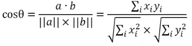

# 核心思想

- 基于商品的用户UGC标签信息，用TF-IDF算法提取特征向量
- 计算特征向量的余弦相似度，从而得到商品的相似列表
- 在实际应用中，一般会在商品详情页、商品购买页将相似商品推荐出来

# 创建模块

- 在Commender模块下创建子模块，命名为ContentRecommender
- 在pom文件中导入依赖
- 在resources文件夹中加入log4j文件
- 将java文件夹改名为scala
- 在scala文件夹下创建scala calss 文件，类型为object，命名为ContentRecommender

# 代码编写

## 定义样例类

- 因为推荐商品需要根据商品信息，所以需要定义商品样例类
- 最后产生的是一个商品相似度列表，所以还需要一个推荐列表样例类
- 还需要连接到MongoDB，所以需要定义MongoDB配置样例类

## 定义常量

- 需要从product表中读取数据
- 需要向MongoDB中写入数据

```scala
  val MONGODB_PRODUCT_COLLECTION = "Product"
  val CONTENT_PRODUCT_RECS = "ContentBasedProductRecs"
```

## 定义配置内容

- 创建spark session
- 定义隐式参数
- 定义配置参数

```scala
    val config = Map(
      // 启用本地多线程
      "spark.cores" -> "local[*]",
      // 定义Mongo的uri
      "mongo.uri" -> "mongodb://localhost:27017/recommender",
      // 定义db
      "mongo.db" -> "recommender"
    )

    // 创建spark配置项
    val  sparkConf = new SparkConf().setMaster(config("spark.cores")).setAppName("OfflineRecommender")
    // 创建spark session
    val spark = SparkSession.builder().config(sparkConf).getOrCreate()

    import spark.implicits._
    // 创建隐式参数
    implicit val mongoConfig = MongoConfig(config("mongo.uri"),config("mongo.db"))
```

## 载入数据

- 加载商品数据，将数据进行预处理

```scala
    // 加载数据
    val productTagsDF = spark.read
      .option("uri", mongoConfig.uri)
      .option("collection", MONGODB_PRODUCT_COLLECTION)
      .format("com.mongodb.spark.sql")
      .load()
      .as[Product]
      .map(
        x => (x.productId, x.name, x.tags
          //这里将tags里的|替换成空格
        .map(
          // 遍历了每一个字符
          c => if(c == "|") " "
          else c
        ))
      )
      .toDF("productId", "name", "tags")
```

## 计算相似列表

- 使用TF-IDF提取商品的关于UGC标签的特征向量
- 对商品两两计算余弦相似度

### 获取特征向量

1. 定义分词器将tags列按照空格进行切分，转换成数组

   ```scala
       // 1、初始化一个分词器，将tags列数据进行切分转换成数组形式
       val tokenizer = new Tokenizer().setInputCol("tags").setOutputCol("words")
       // 使用分词器，将数据进行转换
       val wordsDataDF = tokenizer.transform(productTagsDF)
   ```

   

2. 定义HashingTF工具，计算每个特征出现的频次

   ```scala
       val hashingTF = new HashingTF().setInputCol("words").setOutputCol("rowFeatures").setNumFeatures(1000)
       // 使用工具计算特征出现频次
       val featurizeDataDF = hashingTF.transform(wordsDataDF)
   ```

   

3. 定义IDF工具，计算TF-IDF

   ```scala
       val idf = new IDF().setInputCol("rowFeatures").setOutputCol("features")
       // 训练一个IDF模型
       val idfModel = idf.fit(featurizeDataDF)
       // 使用训练的模型计算出新列features，多出的新列就是特征向量
       val rescaleDataDF = idfModel.transform(featurizeDataDF)
   ```

   

4. 将rescaleDataDF转换成我们需要的形式

   ```scala
       val productFeatures = rescaleDataDF.map{
         row => (row.getAs[Int]("productId"), row.getAs[SparseVector]("features").toArray)
       }.rdd
         .map{
           case (productId, features) => (productId, new DoubleMatrix(features))
         }
   ```

   

### 计算余弦相似度

```scala
// 两两配对商品（自己与自己做笛卡尔积）
    val productRecs =productFeatures.cartesian(productFeatures)
      // 过滤掉自己和自己配对的数据
      .filter{
        case (a,b) => a._1 != b._1
      }
      // 将数据改为如下格式:(商品id, (被比较的商品Id, 相似度))
      .map{
        case (a, b) =>
          // 在这里计算了余弦相似度
          val simScore = consinSim(a._2,b._2)
          // 这里是最终修改的数据格式
          (a._1, (b._1, simScore))
      }
      // 根据第二项中的第二项，过滤掉分数较小的数据
      .filter(_._2._2 > 0.4)
      // 和前边一样，对数据按照productId进行分组
      .groupByKey()
      // 将数据转换成我们想要的格式，也就是ProductRecs样例类的类型
      .map{
        case (productId,recs) =>
          ProductRecs(productId, recs.toList.sortWith(_._2>_._2)
            // 将数据转换成Recommendation样例类格式
            .map(x=>Recommendation(x._1,x._2)))
      }
      // 转换成可以写入数据库的类型
      .toDF()
```

### 定义余弦相似度函数

```scala
  def consinSim(product1: DoubleMatrix, product2: DoubleMatrix): Double={
    product1.dot(product2)/(product1.norm2()*product2.norm2())
  }
```

# 总代吗

```scala
import org.apache.spark.SparkConf
import org.apache.spark.ml.feature.{HashingTF, IDF, Tokenizer}
import org.apache.spark.ml.linalg.SparseVector
import org.apache.spark.sql.SparkSession
import org.jblas.DoubleMatrix

/**
 * @商品样例类
 * @param productId
 * @param name
 * @param imageUrl
 * @param categories
 * @param tags
 */
case class Product(productId: Int, name: String, imageUrl: String, categories: String, tags: String);

/**
 * @连接配置样例类
 * @param uri
 * @param db
 */
case class MongoConfig(uri: String, db: String);

/**
 * @推荐项样例类
 * @param productId
 * @param score
 */
case class Recommendation(productId: Int, score: Double);

/**
 * @推荐列表样例类
 * @param productId
 * @param recs
 */
case class ProductRecs(productId: Int, recs: Seq[Recommendation]);

object ContentRecommender {
  val MONGODB_PRODUCT_COLLECTION = "Product"
  val CONTENT_PRODUCT_RECS = "ContentBasedProductRecs"
  def main(args: Array[String]): Unit = {
    val config = Map(
      // 启用本地多线程
      "spark.cores" -> "local[*]",
      // 定义Mongo的uri
      "mongo.uri" -> "mongodb://localhost:27017/recommender",
      // 定义db
      "mongo.db" -> "recommender"
    )

    // 创建spark配置项
    val  sparkConf = new SparkConf().setMaster(config("spark.cores")).setAppName("OfflineRecommender")
    // 创建spark session
    val spark = SparkSession.builder().config(sparkConf).getOrCreate()

    import spark.implicits._
    // 创建隐式参数
    implicit val mongoConfig = MongoConfig(config("mongo.uri"),config("mongo.db"))

    // 加载数据
    val productTagsDF = spark.read
      .option("uri", mongoConfig.uri)
      .option("collection", MONGODB_PRODUCT_COLLECTION)
      .format("com.mongodb.spark.sql")
      .load()
      .as[Product]
      .map(
        x => (x.productId, x.name, x.tags
          //这里将tags里的|替换成空格
        .map(
          // 遍历了每一个字符
          c => if(c == '|') ' '
          else c
        ))
      )
      .toDF("productId", "name", "tags")
      .cache()

    // TODO：用TF-IDF计算商品特征向量
    // 1、初始化一个分词器，将tags列数据进行切分转换成数组形式
    val tokenizer = new Tokenizer().setInputCol("tags").setOutputCol("words")
    // 使用分词器，将数据进行转换
    val wordsDataDF = tokenizer.transform(productTagsDF)

    // 2、定义 HashingTF 工具，计算频次
    // 定义 HashingTF 工具
    val hashingTF = new HashingTF().setInputCol("words").setOutputCol("rowFeatures").setNumFeatures(1000)
    // 使用工具计算特征出现频次
    val featurizeDataDF = hashingTF.transform(wordsDataDF)

    // 3、定义IDF工具，计算TF-IDF
    val idf = new IDF().setInputCol("rowFeatures").setOutputCol("features")
    // 训练一个IDF模型
    val idfModel = idf.fit(featurizeDataDF)
    // 使用训练的模型计算出新列features，多出的新列就是特征向量
    val rescaleDataDF = idfModel.transform(featurizeDataDF)

    // 4、对数据进行转换，得到RDD形式的features
    val productFeatures = rescaleDataDF.map{
          // SparseVector是稀疏矩阵矩阵类型
      row => (row.getAs[Int]("productId"), row.getAs[SparseVector]("features").toArray)
    }.rdd
      .map{
        case (productId, features) => (productId, new DoubleMatrix(features))
      }

    // 两两配对商品（自己与自己做笛卡尔积）
    val productRecs =productFeatures.cartesian(productFeatures)
      // 过滤掉自己和自己配对的数据
      .filter{
        case (a,b) => a._1 != b._1
      }
      // 将数据改为如下格式:(商品id, (被比较的商品Id, 相似度))
      .map{
        case (a, b) =>
          // 在这里计算了余弦相似度
          val simScore = consinSim(a._2,b._2)
          // 这里是最终修改的数据格式
          (a._1, (b._1, simScore))
      }
      // 根据第二项中的第二项，过滤掉分数较小的数据
      .filter(_._2._2 > 0.4)
      // 和前边一样，对数据按照productId进行分组
      .groupByKey()
      // 将数据转换成我们想要的格式，也就是ProductRecs样例类的类型
      .map{
        case (productId,recs) =>
          ProductRecs(productId, recs.toList.sortWith(_._2>_._2)
            // 将数据转换成Recommendation样例类格式
            .map(x=>Recommendation(x._1,x._2)))
      }
      // 转换成可以写入数据库的类型
      .toDF()

    productRecs.write
      .option("uri",mongoConfig.uri)
      .option("collection",CONTENT_PRODUCT_RECS)
      .mode("overwrite")
      .format("com.mongodb.spark.sql")
      .save()

    // 结束
    spark.stop()
  }
  def consinSim(product1: DoubleMatrix, product2: DoubleMatrix): Double={
    product1.dot(product2)/(product1.norm2()*product2.norm2())
  }
}
```

# 测试

- 运行代码，然后查看MongoDB数据库，可以发现多了一个数据库：ContentBasedProductRecs


- 查看数据

  ```cmd
  db.ContentBasedProductRecs.find().pretty()
  ```

