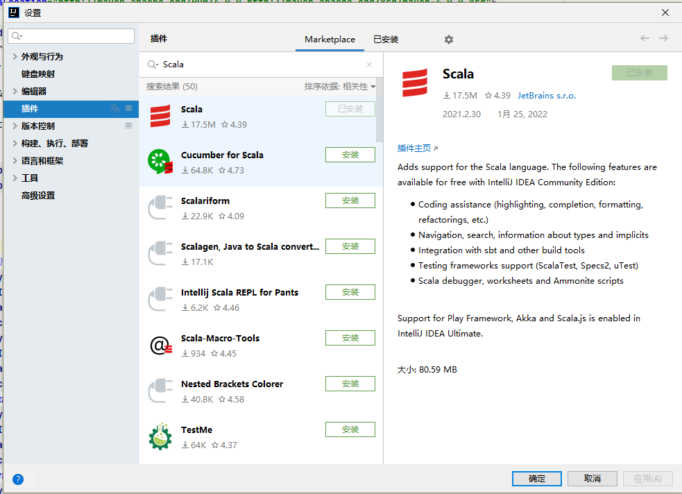
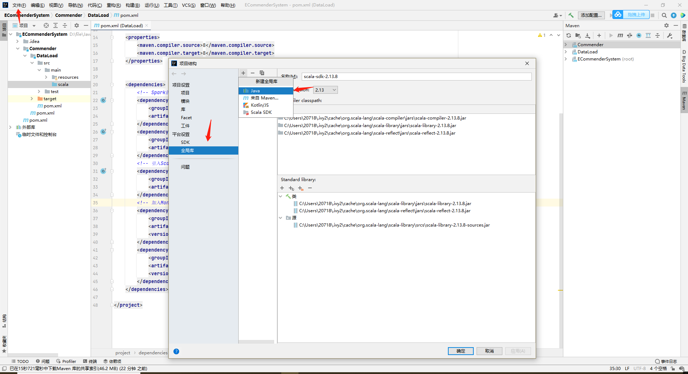
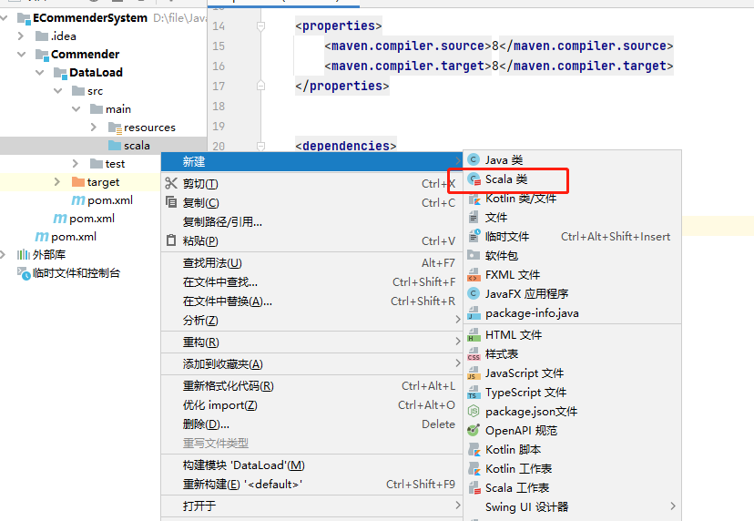

# 参考网址

https://blog.csdn.net/XIAOMO__/article/details/107810657

# 步骤

## 安装Scala

- 安装Scala应用，采用idea自动安装
- 在idea插件中搜索Scala，安装

## 设置Scala SDK

- 点击：文件，项目结构，全局库，点击+，Scala SDK
- 没有SDK下载SDK，有的话直接指定项目DataLoad的SDK
- 此时，在DataLoad项目的src/main下的scala文件夹上右击，新建就有Scala Class选项

